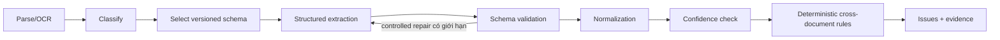

# Thiết kế extraction và deterministic validation

## Ranh giới trách nhiệm

Extraction model đề xuất dữ liệu có cấu trúc và confidence; model không quyết
định field đúng, rule pass/fail, severity hoặc case status. Schema validator,
normalizer và deterministic rule engine là code có version, chạy lặp lại được
với cùng input/configuration. Mọi kết quả phải truy vết về active document,
`ProcessingRun`, schema version và evidence nguồn.

## Versioned schema contract

Schema registry dùng khóa `document_type + schema_version`. Mỗi
`pipeline_version` pin rõ parser, classifier, extraction schema, normalization
policy, confidence policy và rule-catalog version. Không thay nội dung một
schema đã phát hành; thay đổi field/type/constraint tạo version mới và cần
migration/reprocess có audit.

Structured output có envelope tối thiểu:

- `document_type`: một trong năm tên đã phê duyệt;
- `schema_version` và `pipeline_version`;
- `fields`: danh sách field theo schema, không nhận key tùy ý;
- `raw_value`: giá trị bám sát PDF;
- `normalized_value`: giá trị chuẩn hóa để so sánh/rule;
- `confidence`: số từ `0.0` đến `1.0` do extraction adapter trả;
- `evidence`: một hoặc nhiều evidence reference;
- model/parser identifiers phục vụ lineage, không dùng để quyết định state.

Unknown keys bị từ chối hoặc lưu riêng trong diagnostic payload không tham gia
rule/retrieval. Schema validator kiểm tra type, required key, enum, format và
array shape. Nếu output invalid, pipeline chỉ cho phép controlled repair trong
budget được versioned policy giới hạn. Output vẫn invalid sau controlled repair
là permanent schema failure; không retry vô hạn qua model.

## Bộ field chuẩn của năm document type

Tên field dùng `snake_case`. Required/critical được versioned schema và rule
catalog thực thi; tài liệu này định nghĩa contract MVP nền tảng.

### `company_profile`

- `legal_name` — required, critical; tên pháp lý đầy đủ.
- `trading_name` — optional; tên thương mại.
- `registered_address` — required; địa chỉ đăng ký công bố trong profile.
- `website` — optional.
- `primary_contact_name` và `primary_contact_email` — optional.
- `business_description` — required; mô tả hoạt động/sản phẩm chính.
- `established_date` — optional.

### `business_registration`

- `legal_name` — required, critical.
- `registration_number` — required, critical.
- `registration_authority` — required.
- `registration_date` — required.
- `registered_address` — required.
- `legal_form` — optional.
- `registration_status` — optional.

### `tax_registration`

- `legal_name` — required, critical.
- `tax_id` — required, critical.
- `tax_authority` — required.
- `tax_registration_date` — optional.
- `registered_address` — optional.

### `bank_information_form`

- `account_holder` — required, critical.
- `account_number` — required, critical; encrypted at rest và masked khi hiển
  thị/log.
- `bank_name` — required.
- `bank_branch` — optional.
- `swift_bic` — optional.
- `account_currency` — required.
- `bank_address` — optional.

### `quotation`

- `supplier_legal_name` — required; đối chiếu với `legal_name`.
- `quotation_number` — required.
- `quotation_date` — required.
- `quotation_validity` — required, critical; biểu diễn ngày hết hạn đã suy ra
  hoặc khoảng/điều khoản hiệu lực với raw evidence.
- `currency` — required.
- `line_items` — required array gồm `description`, `quantity`, `unit_price`,
  optional `tax_rate` và `line_total`.
- `subtotal`, `discount_total`, `tax_total` — optional theo biểu mẫu nhưng phải
  được rule calculation kiểm tra khi xuất hiện.
- `quotation_total` — required, critical.
- `payment_terms` và `delivery_terms` — optional.

Bảy critical-field concepts phải luôn được báo cáo ở cấp case: legal name,
registration number, tax ID, account holder, account number, quotation total và
quotation validity. Nếu không có value/evidence đáng tin, engine tạo issue thay
vì để model bù đoán.

## Normalization

Normalizer luôn giữ `raw_value`; `normalized_value` không ghi đè nguồn.

- Text: Unicode normalization, trim/collapse whitespace; so sánh tên có một
  comparison key case-insensitive nhưng giá trị hiển thị vẫn giữ nguyên.
- Identifier: bỏ separator trình bày được schema cho phép, uppercase khi chuẩn
  quốc gia/quốc tế yêu cầu; không tự bỏ leading zero.
- Date: ISO 8601 `YYYY-MM-DD` khi xác định đủ ngày; ambiguous date tạo issue,
  không tự đoán locale.
- Money: decimal chính xác và ISO 4217 currency; không dùng binary float. Dấu
  phân cách phải theo evidence/schema và rounding policy versioned.
- Percentage/quantity: decimal canonical cùng unit; không tự đổi unit khi thiếu
  conversion rule.
- Address: chuẩn hóa whitespace, line breaks và comparison tokens; giữ raw
  address để reviewer đối chiếu.
- Email/URL/SWIFT-BIC: syntax normalization theo standard tương ứng; syntax hợp
  lệ không đồng nghĩa entity đã được xác minh.
- Account number: canonical value chỉ tồn tại ở encrypted field; UI, log, trace,
  fixture và report chỉ dùng masked value/fingerprint tenant-scoped.

Mọi normalizer có version và deterministic fixture. Khi normalization thất bại,
field vẫn giữ raw/evidence và rule engine tạo issue phù hợp.

## Confidence policy

Confidence là tín hiệu từ `ExtractionModel`, không phải xác suất pháp lý và
không thể tự quyết định severity. Hai threshold bắt buộc là
`critical_confidence_threshold` và `field_confidence_threshold`; chúng là
configuration số trong miền `[0.0, 1.0]`, được pin trong `pipeline_version` và
calibrate bằng evaluation trước khi phát hành. Requirements hiện hành không phê
duyệt giá trị mặc định, vì vậy implementation không được tự hard-code một con số
trong code hoặc prompt.

- critical field đạt ngưỡng khi confidence lớn hơn hoặc bằng
  `critical_confidence_threshold`;
- non-critical field đạt ngưỡng khi confidence lớn hơn hoặc bằng
  `field_confidence_threshold`;
- field dưới ngưỡng vẫn được lưu với evidence nhưng không được coi là verified;
- missing required field không được thay bằng hallucinated value.

Rule `CONFIDENCE_CRITICAL_LOW` phát `ERROR` cho critical field thiếu hoặc dưới
`critical_confidence_threshold`. Rule `CONFIDENCE_FIELD_LOW` phát `WARNING` cho
non-critical required field dưới `field_confidence_threshold`; optional field
dưới ngưỡng có thể phát `INFO` theo schema. Threshold thay đổi cần
configuration/rule-catalog version mới và evaluation.

## Severity model

- `ERROR`: chặn `READY_FOR_REVIEW`; chỉ deterministic workflow mới đánh giá đã
  hết lỗi.
- `WARNING`: reviewer cần xem nhưng không chặn `READY_FOR_REVIEW`.
- `INFO`: ghi chú, không chặn.

Agent và model không được tạo, xóa, hạ severity hoặc đánh dấu issue resolved.
Severity được map cố định từ versioned rule definition. Một rule execution lưu
input references, normalized operands, outcome, severity và rule version để tái
lập.

## Rule catalog MVP

Mỗi rule có stable `rule_id`, version, document types, input fields, deterministic
predicate, severity, message template và evidence policy.

### Completeness và required fields

- `COMPLETENESS_DOCUMENT_SET`: đủ đúng năm active document type; `ERROR` khi
  thiếu.
- `REQUIRED_FIELD_MISSING`: required field không có value/evidence; `ERROR` cho
  critical/required MVP fields.

### Format

- `FORMAT_REGISTRATION_NUMBER`: registration number không đạt versioned format;
  severity theo schema nhưng critical mismatch không được bỏ qua.
- `FORMAT_TAX_ID`: tax ID không đạt format; `ERROR`.
- `FORMAT_BANK`: currency/SWIFT-BIC/account-number shape không hợp lệ; không log
  account number.
- `FORMAT_DATE_OR_MONEY`: date/currency/decimal ambiguous hoặc invalid.

### Cross-document consistency

- `CONSISTENCY_LEGAL_NAME`: đối chiếu normalized legal name giữa profile,
  registrations, bank account holder và quotation supplier; mismatch có
  evidence từ cả hai phía.
- `CONSISTENCY_ADDRESS`: phát hiện khác biệt địa chỉ cần reviewer xem.
- `CONSISTENCY_IDENTIFIER_DUPLICATE`: tax/registration identifier trùng hoặc
  xung đột trong tenant-scoped dataset theo policy.

### Quotation validity và calculation

- `QUOTATION_VALIDITY`: quotation hết hạn/không suy ra được validity tại thời
  điểm validation; dùng explicit evaluation date trong `ValidationRun`.
- `QUOTATION_LINE_CALCULATION`: kiểm tra quantity × unit price, tax/discount và
  rounding theo currency policy.
- `QUOTATION_TOTAL_CALCULATION`: đối chiếu line totals/subtotal/tax/discount với
  `quotation_total` trong configured tolerance.

### Confidence, duplicate và version

- `CONFIDENCE_CRITICAL_LOW` và `CONFIDENCE_FIELD_LOW` áp thresholds đã pin.
- `DUPLICATE_DOCUMENT_HASH`: SHA-256 trùng trong cùng tenant/case và document
  lifecycle cần được chỉ rõ, không tự xóa version.
- `ACTIVE_DOCUMENT_VERSION`: rule chỉ dùng active document version và active
  successful `ProcessingRun`; stale output không tham gia quyết định.

Rule catalog bao phủ completeness, required fields, format, cross-document
consistency, quotation validity/calculation, confidence và duplicate/version.
Deterministic tests phải đạt **100%** expected cases.

## Evidence contract

`Evidence` là immutable lineage record, tối thiểu gồm:

- `evidence_id`, `tenant_id`, `case_id`, `document_id`, document type và version;
- `processing_run_id`, parser/schema/pipeline versions;
- page number theo một quy ước ổn định được API công bố;
- `evidence_snippet` là đoạn ngắn đúng page/chunk, không phải toàn văn PDF;
- `bounding_region` khi `DocumentParser` cung cấp, gồm page và coordinates với
  coordinate system/unit rõ ràng;
- source block/chunk identifier và content hash để phát hiện stale citation.

Mỗi `ExtractedField` liên kết một hoặc nhiều evidence records. Mỗi
`ValidationIssue` liên kết evidence cho mọi operand cần đối chiếu; issue “missing”
liên kết document/page/section đã kiểm tra và machine-readable missing reason
thay vì tạo snippet giả.

Backend chỉ phát evidence/citation khi record tồn tại, thuộc đúng tenant/case,
trỏ active document, page/chunk khớp và snippet thuộc nguồn đã hash. Bank account
evidence phải mask giá trị trong API/UI; unmasked data không xuất hiện trong log,
trace, fixture hoặc generated report.

## Kết quả và chuyển state

Mỗi `ValidationRun` pin active document versions, active successful processing
runs, rule-catalog version, confidence configuration và evaluation timestamp.
Run tạo `ValidationIssue`/evidence atomically. Deterministic workflow:

- giữ case ở `VALIDATION_REQUIRED` khi còn `ERROR` hoặc input chưa đủ;
- cho phép chuyển `READY_FOR_REVIEW` khi không còn `ERROR` và required validation
  đã hoàn tất;
- không để extraction model, LLM hoặc Agent tự chuyển state;
- không biến schema/parser/model technical failure thành `REJECTED`.
