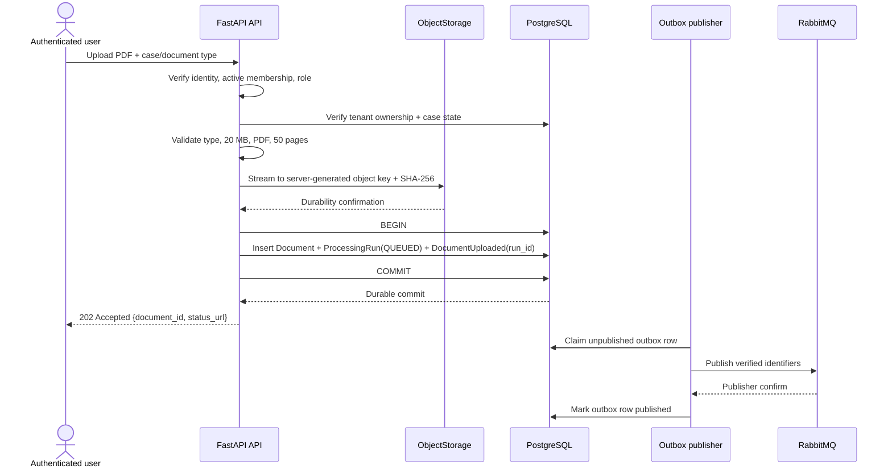
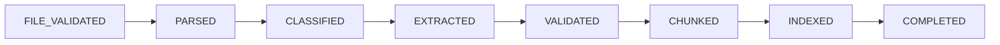

# Thiết kế ingestion pipeline

## Mục tiêu và bất biến

Ingestion tiếp nhận PDF tiếng Anh của năm document type, xác nhận bền vững trước
khi trả response và xử lý nền an toàn dưới at-least-once delivery. Các bất biến:

- mỗi file tối đa **20 MB** và **50 pages**;
- API không acknowledge nếu object chưa durable hoặc database/outbox chưa commit;
- `Document`, initial `ProcessingRun` ở `QUEUED` và `DocumentUploaded` outbox
  event được tạo trong cùng database transaction;
- message chỉ chứa verified identifiers, không chứa PDF binary;
- worker dedupe delivery theo `run_id + checkpoint/stage` (và `message_id` khi
  cần); `document_id + pipeline_version` chỉ là lineage/active-result
  comparison invariant;
- redelivery/retry không tạo extracted field, evidence hoặc chunk trùng;
- technical failure chỉ đổi processing status, không tự đổi business state thành
  `REJECTED`.

## Upload và `202 Accepted`



### Kiểm tra trước write

API thực hiện theo thứ tự fail-fast:

1. Xác minh token, authenticated user và active membership; dẫn xuất
   `tenant_id`, role và user từ server-side context.
2. Kiểm tra supplier/case/document thuộc cùng tenant, role được upload và case
   state cho phép mutation. Initial upload được nhận ở `DRAFT`; additional
   upload/replacement được nhận ở `DOCUMENTS_UPLOADED`, `PROCESSING`,
   `VALIDATION_REQUIRED` và `READY_FOR_REVIEW`. Reprocess dùng cùng nonterminal
   set nhưng yêu cầu active document; `APPROVED`/`REJECTED` bị từ chối.
3. Chỉ chấp nhận `company_profile`, `business_registration`, `tax_registration`,
   `bank_information_form` hoặc `quotation`.
4. Giới hạn stream ở 20 MB; kiểm tra PDF signature/content thay vì tin MIME hay
   filename từ client.
5. Parse cấu trúc đủ để từ chối corrupted, password-protected, invalid PDF và
   file vượt 50 pages. File ngoài phạm vi PDF tiếng Anh nhận lỗi ổn định, không
   tạo job ingestion.
6. Sinh object key ở server với tenant/case/document identifiers; không dùng
   filename client làm path.

API stream một lượt có giới hạn, đồng thời tính SHA-256. Chỉ sau durability
confirmation của object storage mới mở/hoàn tất database transaction tạo
`Document`, initial `ProcessingRun(QUEUED)` và outbox row có cùng `run_id`. Với
replacement, transaction cũng tăng case optimistic-lock version, chuyển active
document version, clear active validation cùng affected result/index pointers
và đưa nonterminal case về `PROCESSING`. Nếu object write lỗi, không tạo record.
Nếu database transaction lỗi sau object write, API không trả `202`; orphan
object không được tham chiếu và được một cleanup job tenant-safe loại bỏ sau
retention window.

Response `202 Accepted` chỉ gồm `document_id` và `status_url` cần để polling;
không hứa processing đã hoàn tất. P95 acknowledgement dưới **500 ms** được đo từ
byte cuối server nhận đến khi tạo response, bao gồm validation, storage
finalization, SHA-256, database/outbox commit và response generation.

## Transactional outbox và RabbitMQ

`DocumentUploaded` dùng PascalCase và chứa tối thiểu `event_id`, `tenant_id`,
`case_id`, `document_id`, `document_version`, `run_id`, `pipeline_version`,
object identifier và trace identifiers đã được API xác minh. Event không chứa
PDF binary, full document text hoặc bank-account value.

Outbox publisher:

1. claim unpublished row bằng cơ chế chống hai publisher cùng sở hữu;
2. publish persistent message với publisher confirm;
3. chỉ đánh dấu published sau confirm;
4. retry publish khi chưa có confirm; duplicate publish vẫn an toàn vì consumer
   idempotent.

API là owner duy nhất của initial `ProcessingRun`: upload transaction tạo run ở
`QUEUED`. Outbox publisher/dispatcher chỉ publish `run_id` đã tồn tại, không tạo
run. Idempotent dispatch keyed by `event_id + run_id` khiến publisher retry
không nhân bản run hoặc job identity.

PostgreSQL outbox là source of truth cho event chưa phát. RabbitMQ dùng durable
queue và at-least-once delivery nhưng không phải source of truth hoặc recovery
source. PDF gốc trong object storage và metadata PostgreSQL phải đủ để rebuild
search index và reprocess.

Mỗi queue message giữ `tenant_id`, `case_id`, `document_id`, `run_id`,
`pipeline_version`, `event_id`, correlation/trace identifiers và retry metadata.
Worker không nhận tenant từ model hay PDF; nó đối chiếu identifiers với database
trước khi đọc object hoặc ghi kết quả.

## Idempotency, run và checkpoint

Có hai lớp idempotency. API `Idempotency-Key` + request fingerprint chống lặp
cùng một user intent; mỗi reprocess mới được chấp nhận tạo `run_id` và
`reprocess_generation` riêng. Worker dedupe delivery theo `run_id +
checkpoint/stage` (và `message_id` khi cần), nên duplicate broker delivery của
cùng job không tạo output trùng. `document_id + pipeline_version` chỉ dùng cho
lineage, active-result comparison và invariant; nó không suppress reprocess mới.

Initial run do API upload transaction tạo. Explicit reprocess cũng do API use
case tạo sau authorization; scheduler tạo child `ProcessingRun` cho transient
retry. Worker chỉ claim/update run đã tồn tại và không tự tạo initial run.



Mỗi checkpoint được commit atomically cùng output của stage và thông tin
`run_id`, `document_id`, `pipeline_version`. Consumer ack message chỉ sau khi
checkpoint/kết quả cần thiết đã commit. Khi message bị redeliver:

- nếu `COMPLETED`, worker không chạy model lại và trả kết quả idempotent;
- nếu checkpoint trung gian hợp lệ, worker tiếp tục từ stage kế tiếp;
- nếu output không khớp schema/pipeline version hiện hành, worker không dùng nó
  như checkpoint hợp lệ;
- unique/upsert constraints trong scope `run_id + checkpoint/stage` ngăn
  duplicate field, evidence và chunk; records vẫn mang `document_id +
  pipeline_version` để đối chiếu lineage.

Mỗi retry/reprocess có `ProcessingRun` riêng cho audit; chỉ một run
`SUCCEEDED` được chọn làm active result. Việc chọn active chỉ xảy ra atomically
sau `COMPLETED`, không làm mất run hoặc document version cũ.

## Phân loại lỗi và retry

### Transient failure

Các lỗi được retry tối đa **ba lần** là timeout, rate limit, service unavailable
và lỗi kết nối tạm thời. Workflow:

1. lưu error code an toàn và đánh dấu run `RETRY_PENDING`;
2. tính exponential backoff + jitter từ retry count trong server-controlled
   policy;
3. phát job retry với run/checkpoint identity phù hợp, tenant context và
   checkpoint;
4. tạo lineage `ProcessingRun` cho lần retry nhưng không nhân bản output.

Retry budget là ba lần retry sau lần chạy đầu; không adapter nào được tự tạo
vòng retry vô hạn bên ngoài budget chung. Khi hết budget, run cuối là `FAILED`
và message được đưa vào dead-letter queue.

### Permanent failure

Không tự retry các lỗi: corrupted/password-protected/invalid PDF bị phát hiện
muộn, document type không hỗ trợ, invariant/authorization scope sai, hoặc schema
vẫn invalid sau một controlled repair trong extraction policy. Run chuyển
`FAILED`; message chuyển dead-letter queue với identifiers, error class và
lineage, không chứa nội dung nhạy cảm.

### Dead-letter và khôi phục

- Dead-letter queue tách theo message contract/version và có alert theo queue
  depth/job age.
- Operator không replay trực tiếp message tùy ý. Reprocess đi qua API, xác minh
  active membership, tenant ownership và case/document state, rồi tạo
  `ProcessingRun` mới.
- Replay giữ original event/run references và cùng `pipeline_version`, hoặc dùng
  pipeline version mới được triển khai rõ ràng; idempotency vẫn áp dụng.
- Dead-letter không đổi case thành `REJECTED`. UI hiển thị technical `FAILED`
  và hướng xử lý/reprocess riêng.

## Replacement, reprocess và validation trigger

Replacement tạo `Document` version mới; reprocess giữ nguyên `Document` nhưng
tạo `ProcessingRun` mới. Initial upload được phép ở `DRAFT`; additional
upload/replacement/reprocess được phép ở `DOCUMENTS_UPLOADED`, `PROCESSING`,
`VALIDATION_REQUIRED` và `READY_FOR_REVIEW`, với reprocess yêu cầu active
document. `APPROVED`/`REJECTED` từ chối request; muốn thay đổi terminal case cần
một future reopen contract, không bypass bằng upload API.

Trong cùng transaction nhận replacement/reprocess, API:

1. kiểm tra active membership, role, tenant ownership, case state và optimistic
   lock version;
2. với replacement, atomically chuyển active document version; với reprocess,
   giữ active document;
3. clear active `ValidationRun` pointer và affected document active
   processing/index result pointers, nhưng giữ mọi record cũ cho audit;
4. tăng case version, đưa case về `PROCESSING` và tạo run/outbox tương ứng.

Reprocess trong `PROCESSING` chỉ được nhận khi active document không có run
`QUEUED`, `RUNNING` hoặc `RETRY_PENDING`; nếu có, API trả conflict thay vì tạo
hai run cạnh tranh. Sau khi run hiện tại kết thúc, reprocess cùng
`pipeline_version` vẫn tạo `ProcessingRun`/kết quả mới với `run_id` và
`reprocess_generation` mới; active-version/lineage guard ngăn output cũ trở
thành active.

Vì case version và active validation pointer thay đổi atomically, review command
đồng thời trên `READY_FOR_REVIEW` trả `409` hoặc
`CASE_NOT_READY_FOR_REVIEW`; nó không thể quyết định trên stale evidence. Run
đang chạy của document version cũ có thể hoàn tất cho audit nhưng không được
chọn active hoặc kích hoạt validation mới.

Validation không chờ đủ năm document types. Workflow tạo `ValidationRun` khi
**tất cả active documents hiện đã upload** có current processing-lineage leaf ở
terminal status `SUCCEEDED` hoặc `FAILED`. Historical parent runs có
`RETRY_PENDING` không chặn gate sau khi child retry đã trở thành current leaf.
Snapshot pin terminal leaves và successful results; `FAILED`/không có active
successful result tạo deterministic `ERROR`, và mỗi absent required document
type cũng tạo `COMPLETENESS_DOCUMENT_SET` `ERROR`. Case vì vậy đi từ
`PROCESSING` sang `VALIDATION_REQUIRED` thay vì bị stranded.

Commit `ValidationRun` dùng compare-and-set trên case version và exact active
document/result set. Upload/replacement/reprocess đồng thời làm validation commit
thất bại và chạy lại trên snapshot mới; stale snapshot không thể thành active.

Khi một document còn thiếu được upload hoặc document lỗi được reprocess,
snapshot cũ bị invalidate, case về `PROCESSING`, rồi workflow tạo `ValidationRun`
mới sau khi tập active đã upload lại đạt terminal statuses. Mỗi vòng giữ lineage;
không mutate issue/snapshot cũ.

## Processing status và business state

Processing status độc lập với case business state:

```text
QUEUED → RUNNING → SUCCEEDED
                 ├→ RETRY_PENDING
                 └→ FAILED
```

Upload hợp lệ đưa `DRAFT` sang `DOCUMENTS_UPLOADED`; initial run/outbox đã được
tạo atomically. Deterministic workflow đưa case sang `PROCESSING`. Sau khi mọi
active document đã upload đạt terminal processing status, validation workflow
đưa case sang `VALIDATION_REQUIRED` dù bộ năm loại còn thiếu; chỉ snapshot không
có `ERROR` mới sang `READY_FOR_REVIEW`. Replacement/reprocess hợp lệ từ
`VALIDATION_REQUIRED` hoặc `READY_FOR_REVIEW` invalidate snapshot và quay về
`PROCESSING`. Lỗi kỹ thuật không bao giờ được ánh xạ thành `REJECTED`.

## Telemetry và mục tiêu vận hành

Structured telemetry nối API → outbox → RabbitMQ → worker → external AI service
với request/trace/tenant/case/document/run identifiers, stage, duration và error
code; không log full PDF text hay sensitive values. Metrics gồm outbox age,
queue depth/job age, checkpoint latency, retry count/class, dead-letter count và
processing stage.

Processing P95 dưới **hai phút** tính từ lúc `DocumentUploaded` được published
đến `ProcessingRun` đạt `SUCCEEDED`, chỉ trên successful runs. Failure-detection
latency từ publish đến `FAILED` hoặc dead-letter được báo riêng để failure nhanh
không làm đẹp success latency.
