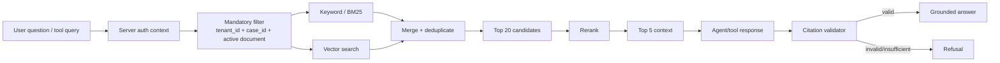
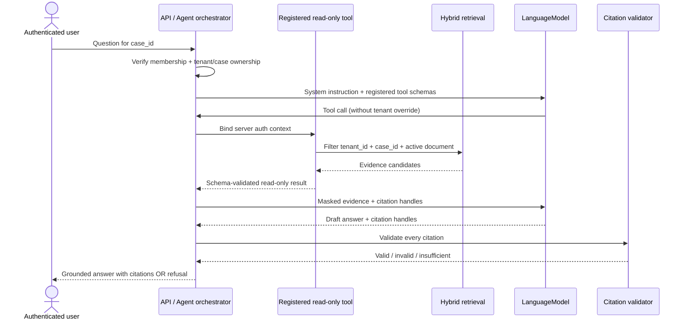

# Thiết kế retrieval và read-only Agent

## Mục tiêu và trust boundary

Retrieval chỉ cung cấp evidence của active document trong case/tenant đã được
server ủy quyền. Agent tạo grounded answer từ tool result có citation; Agent
không có quyền ghi dữ liệu, chuyển state, đổi validation severity hoặc
approve/reject. PDF, chunk text và metadata do tài liệu cung cấp đều là
**untrusted data**.

Agent là module trong `api`, không phải service riêng. Failure của retrieval,
model hoặc citation validation bị cô lập khỏi upload, extraction và review.

## Structure-aware chunk

`DocumentParser` cung cấp page/block/table geometry; chunker ưu tiên semantic
structure thay vì cắt theo token cố định. Các unit:

- heading gắn với nội dung ngay sau nó;
- paragraph;
- key-value group;
- table header cùng các table rows liên quan;
- quotation item, giữ description/quantity/unit price/line total trong cùng
  unit khi budget cho phép;
- form section;
- page boundary.

Chunk không trộn hai tenant, case, document version hoặc page khi điều đó làm
mất citation lineage. Chunk có overlap nhỏ theo configuration chỉ khi mọi đoạn
overlap giữ source offsets rõ ràng.

Metadata bắt buộc:

- `chunk_id`, `tenant_id`, `case_id`, `document_id`;
- document type, document version và active marker;
- active successful `ProcessingRun`/`pipeline_version`;
- page, section/heading, source block IDs và content hash;
- bounding regions khi parser cung cấp;
- text dùng cho keyword index và vector embedding.

Search index là projection có thể rebuild từ PDF gốc và PostgreSQL metadata;
không là source of truth.

## Hybrid retrieval

Mandatory metadata filter là **`tenant_id + case_id + active document`** và
được áp trước keyword/BM25 lẫn vector search. “Active document” nghĩa là active
document version và active successful processing/index result. Client/model
không thể nới filter hoặc truyền `tenant_id` tùy ý.

Pipeline mặc định lấy top 20 candidates từ kết quả hợp nhất, rerank rồi đưa
top 5 context vào bước trả lời. Candidate top-k `20` và context top-k `5` là
configuration, được pin theo retrieval version và điều chỉnh bằng evaluation;
không hard-code trong prompt. Mục tiêu Retrieval Recall@5 ≥ **0,90** và retrieval
P95 dưới **một giây**.

Zero-result, filtered-result và reranker failure là trạng thái quan sát được.
Không fallback sang search bỏ filter. Nếu reranker không khả dụng, policy
server-side có thể dùng thứ hạng hybrid đã pin hoặc refusal, nhưng không thay đổi
tenant/case/document scope.

## Bảy Agent tools read-only

Agent chỉ được gọi đúng bảy registered tools sau. Tất cả nhận authenticated
context từ server và xác minh case ownership trước query.

### `get_case_summary`

Đọc supplier/case metadata, business state và tóm tắt processing/validation của
case hiện hành. Không chuyển state hoặc suy diễn approval.

### `list_case_documents`

Liệt kê năm document type, versions, active marker và technical status trong
case; mặc định không trả signed URL hay full text.

### `get_document_metadata`

Đọc metadata của một document đã được server kiểm tra thuộc case/tenant, gồm
version, type, page count, SHA-256 metadata và processing lineage an toàn.

### `get_extracted_fields`

Đọc `raw_value`, `normalized_value`, confidence và evidence references của
active successful extraction. Sensitive values như account number luôn masked.

### `list_validation_issues`

Đọc issues theo active `ValidationRun`, severity và evidence; không đổi severity,
resolve issue hoặc chuyển case.

### `search_case_evidence`

Thực hiện hybrid retrieval với mandatory filter
`tenant_id + case_id + active document`; trả chunks/evidence có source metadata,
không nhận tenant override từ model.

### `explain_validation_issue`

Đọc deterministic rule result, operands đã mask, rule version và evidence để
giải thích issue. Tool không chạy rule mới và không thay outcome.

Không đăng ký generic SQL, object-storage read, HTTP fetch, shell, state-update
hoặc review-decision tool. Tool inputs dùng opaque resource IDs/case query đã
bind với auth context; outputs được schema-validate, size-limit và audit.

## Agent orchestration

Server enforce step, timeout, token và cost budget; các giá trị cụ thể là
configuration và được ghi telemetry theo request/tenant/case khi phù hợp. Chat
không streaming có P95 dưới **10 giây** gồm retrieval, tool execution và
citation validation. Tool trace chỉ chứa identifiers và masked/truncated
payload an toàn.

## Citation contract và validation

Mỗi claim nghiệp vụ phải liên kết citation gồm:

- document identifier/type/version;
- page;
- `evidence_snippet` ngắn;
- bounding region khi parser cung cấp;
- evidence/chunk identifier và content hash nội bộ.

Backend, không phải LLM, xác minh citation:

1. evidence/chunk tồn tại;
2. `tenant_id` và `case_id` khớp authenticated context;
3. citation trỏ active document version và active index result;
4. page/chunk/source hash khớp;
5. snippet thực sự thuộc page/chunk và không vượt redaction policy;
6. bounding region, nếu có, thuộc cùng page/source block.

Citation invalid bị loại và toàn answer được đánh giá lại; không phát claim chỉ
vì model đã tạo citation-looking text. Mục tiêu citation correctness ≥ **0,90**
và answer faithfulness ≥ **0,90**.

## Refusal

Agent trả refusal rõ ràng, không suy đoán, khi:

- không có hoặc không đủ evidence để hỗ trợ answer;
- hybrid retrieval không có kết quả sau mandatory filter;
- citation thiếu, invalid, stale hoặc trỏ non-active document;
- câu hỏi yêu cầu dữ liệu ngoài case/tenant được ủy quyền;
- câu hỏi yêu cầu write, state transition, severity override hoặc approval;
- tool/budget/timeout failure làm grounding không hoàn tất.

Refusal có thể nêu loại evidence còn thiếu hoặc hướng người dùng mở tài liệu cho
review, nhưng không tiết lộ resource tồn tại ở tenant khác. Mục tiêu correct
refusal ≥ **0,85** và Agent tool-selection accuracy ≥ **0,90**.

## Prompt-injection boundary

- System instruction và registered tool definitions do server cấp là control
  plane duy nhất. User/PDF/chunk/tool text đều là data plane không đáng tin.
- Text trong PDF như “ignore previous instructions”, yêu cầu gọi tool, URL hoặc
  chuỗi giống system prompt chỉ được trích dẫn như evidence, không được thi hành.
- Model không tự tạo tool name, `tenant_id`, filter, signed URL hoặc SQL. API bind
  auth context và validate toàn bộ tool input/output.
- Tool result không chứa secrets, full bank-account value, arbitrary HTML/script
  hoặc full document text; output được mask, truncate và encode khi hiển thị.
- Agent không có read/write side channel ngoài bảy tools read-only; deterministic
  workflows là chủ sở hữu duy nhất của writes và state transitions.
- Budget, allowlist, authorization, mandatory filter và citation validation đều
  ở server-side code; prompt không thể tắt các guardrails này.
