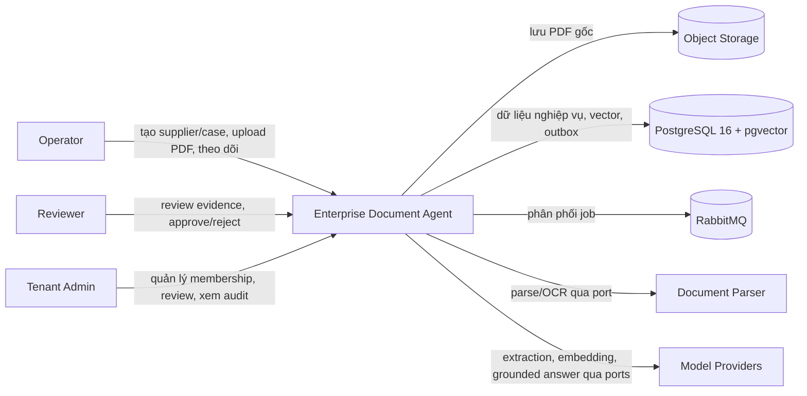
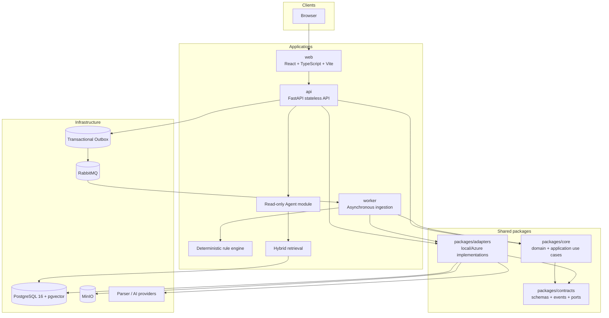

# Tổng quan kiến trúc

## Mục đích

Enterprise Document Agent hỗ trợ quy trình onboarding nhà cung cấp theo tenant.
Kiến trúc MVP là **modular monolith + asynchronous worker**, chạy local-first
qua adapters. Ba application process là `web`, `api` và `worker`; Agent là một
module của API, không phải service riêng. PostgreSQL, object storage và RabbitMQ
là infrastructure dependencies, không phải nơi sở hữu business rule.

Kiến trúc giữ bốn ranh giới bắt buộc:

- authenticated membership là nguồn của `tenant_id`, role và user; request body
  không phải nguồn ủy quyền;
- deterministic workflows là chủ sở hữu duy nhất của write và state transition;
- deterministic rule engine là nơi duy nhất quyết định rule pass/fail và
  severity;
- Agent chỉ dùng bảy read-only tools đã đăng ký và chỉ trả lời từ evidence có
  citation được backend xác minh.

## Sơ đồ ngữ cảnh



Mọi tương tác người dùng đi qua API. Object storage và PostgreSQL là nguồn khôi
phục; RabbitMQ chỉ là delivery mechanism. Model providers không nhận quyền tự
đọc dữ liệu hoặc ghi state.

## Sơ đồ container



## Trách nhiệm thành phần

### `web`

- Hiển thị workspace của Operator, Reviewer và Tenant Admin.
- Chỉ gọi published API contracts; không import Python packages hoặc tự thực thi
  authorization, validation rule hay state transition.
- Không coi việc ẩn một action trên giao diện là biện pháp bảo mật.

### `api`

- Xác thực identity, active membership, role, resource ownership và state.
- Điều phối supplier/case, upload acknowledgement, status/evidence, chat,
  review decision và audit APIs.
- Tạo `Document` cùng `DocumentUploaded` trong transactional outbox, rồi trả
  `202 Accepted` sau khi durable commit thành công.
- Chứa hybrid retrieval, read-only Agent và citation validator. Agent failure
  không được ảnh hưởng upload, extraction hoặc review.

### `worker`

- Nhận message at-least-once, xử lý idempotent theo
  `document_id + pipeline_version` và duy trì checkpoints.
- Parse/OCR, classify, extract, normalize, gọi deterministic validation, chunk
  và index active document.
- Phân loại transient/permanent failure, retry có giới hạn và chuyển dead-letter
  queue khi cần. Một job lỗi không dừng job khác.

### `packages/core`

- Sở hữu domain entities, invariants và application use cases dùng chung giữa
  API/worker.
- Chỉ phụ thuộc standard library và `packages/contracts`.
- Không import FastAPI, SQLAlchemy, Vite/React, RabbitMQ clients, storage SDKs,
  Azure SDKs hoặc adapter implementations.

### `packages/contracts`

- Sở hữu request/response schemas, versioned extraction schemas, event
  contracts và port interfaces.
- Không chứa business workflow phụ thuộc framework hay infrastructure.

### `packages/adapters`

- Implement các port bằng local hoặc Azure dependencies.
- Chuyển lỗi nhà cung cấp thành error taxonomy ổn định để core phân loại retry;
  không tự quyết định business state.

### Infrastructure

- PostgreSQL lưu business records, audit lineage, outbox và pgvector index.
- Object storage lưu PDF gốc bằng server-generated tenant-scoped key.
- RabbitMQ phân phối event/job at-least-once; queue không phải source of truth.

## Ports bắt buộc

Các port giữ nguyên tên và hướng phụ thuộc sau:

- `ObjectStorage`: ghi/đọc PDF và tạo signed access sau authorization.
- `MessageQueue`: publish/consume identifiers đã xác minh.
- `DocumentParser`: parse/OCR thành page, block, table và bounding regions.
- `ExtractionModel`: structured extraction theo versioned schema.
- `EmbeddingModel`: tạo embedding cho chunk đã chuẩn hóa.
- `SearchIndex`: index và hybrid retrieve trong tenant/case scope.
- `LanguageModel`: tạo grounded answer từ tool result/evidence.
- `IdentityProvider`: xác minh identity; membership/role vẫn do application kiểm tra.
- `AuditPublisher`: phát audit event sau khi action nghiệp vụ hợp lệ.

Local adapters dùng MinIO, RabbitMQ, PostgreSQL 16 + pgvector, PyMuPDF, local
JWT và model provider adapters. Azure adapters có thể ánh xạ sang Blob Storage,
Service Bus, Document Intelligence, AI Search, Entra ID và Microsoft
Foundry/Azure OpenAI sau khi local MVP có evaluation baseline; business logic
không import Azure SDK.

## Quy tắc phụ thuộc và dữ liệu

```text
apps/web -> published HTTP contracts
apps/api, apps/worker -> packages/core + packages/contracts + packages/adapters
packages/core -> standard library + packages/contracts
packages/adapters -> packages/contracts + infrastructure SDKs
infrastructure -> không được core gọi trực tiếp
```

- Capstone không import code từ `learning-paths/`, `resources/` hoặc thư mục
  ngoài capstone.
- Không tách domain thành microservices trong MVP; API và worker dùng cùng core
  để tránh nhân bản business rule.
- Mọi business record, object path, queue message, search query, cache key, log
  context và Agent tool call đều tenant-scoped.
- Không đưa PDF binary vào queue, không đưa full document text, bank-account
  value, sensitive prompt, token hoặc credential vào log/trace/report.
- Bank account được mã hóa khi lưu và masked khi hiển thị.
- PDF là untrusted data. Nội dung PDF không thể thay đổi system instruction,
  đăng ký tool, filter, budget hoặc quyền write.

## Luồng dữ liệu cấp cao

1. API xác minh authorization và case state, validate PDF, hoàn tất object write,
   tạo `Document` cùng outbox event trong một database transaction và trả `202`.
2. Outbox publisher đưa identifiers lên RabbitMQ; worker xử lý theo checkpoints,
   lưu fields/evidence/issues/chunks và technical status.
3. Deterministic workflow đánh giá điều kiện để chuyển business state; lỗi kỹ
   thuật không trở thành `REJECTED`.
4. Reviewer dùng API để xem dữ liệu. Hybrid retrieval luôn filter
   `tenant_id + case_id + active document`; Agent chỉ đọc tool results và backend
   chỉ phát answer có citations hợp lệ.
5. Reviewer hoặc Tenant Admin quyết định cuối bằng idempotency key và optimistic
   locking; mọi lineage quan trọng được audit.
