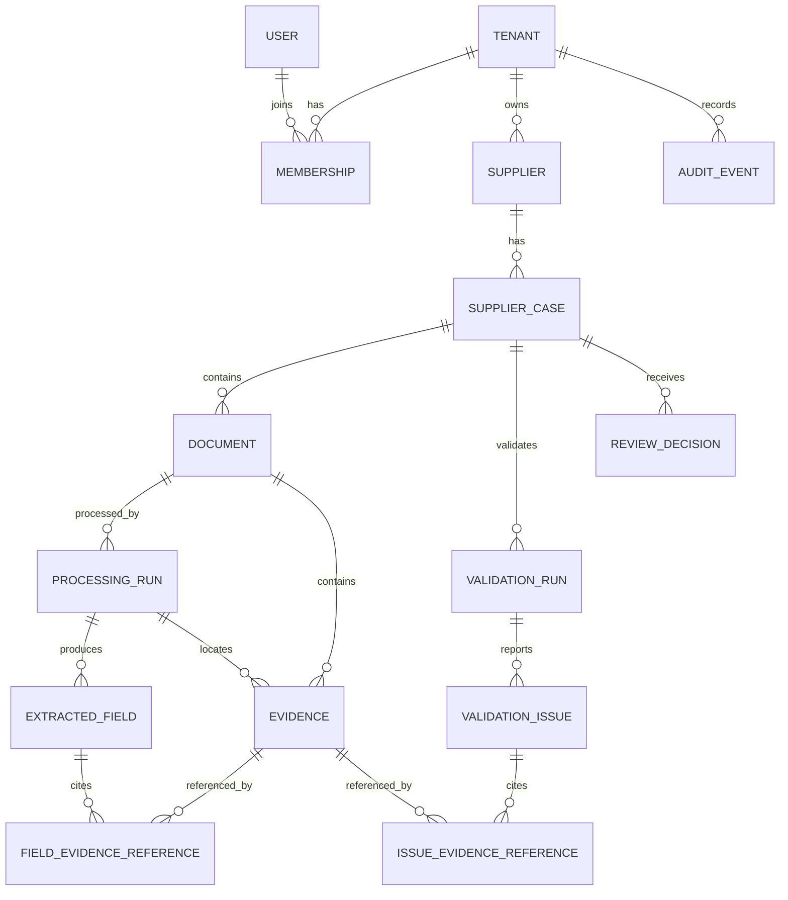
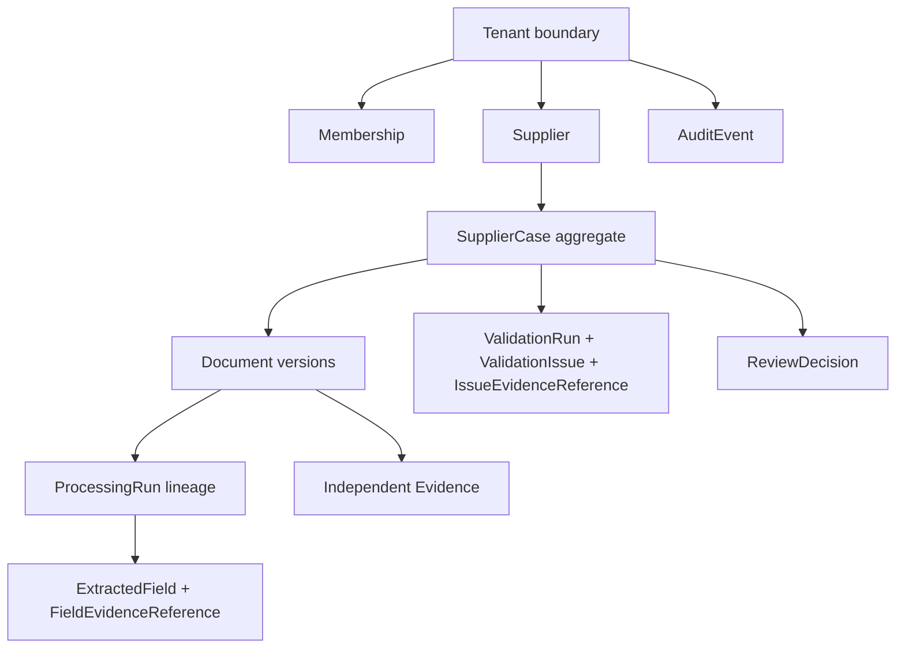

# Domain model

## Ngôn ngữ miền

Mô hình biểu diễn một tenant quản lý supplier onboarding cases. `Document` là
PDF có version; `ProcessingRun` tạo extracted fields/evidence; `ValidationRun`
đối chiếu snapshot active của case; con người ghi `ReviewDecision`. Business
state của case và technical processing status của run là hai khái niệm độc lập.

## Entities

### `Tenant`

Ranh giới isolation cao nhất. `tenant_id` do hệ thống sinh và là thành phần bắt
buộc của mọi business record, object path, queue/search/cache/log context và
Agent tool call. Xóa/đổi tenant không được suy ra từ payload của người dùng.

### `User`

Identity toàn cục từ `IdentityProvider`. `User` không tự mang quyền trên tenant;
quyền hiện hành đến từ active `Membership`.

### `Membership`

Liên kết `User` với `Tenant`, gồm role Operator, Reviewer hoặc Tenant Admin và
active status. Mỗi request dẫn xuất `tenant_id`, user và role từ authenticated
membership; thay đổi membership/role được audit và áp dụng ở request kế tiếp.

### `Supplier`

Supplier thuộc đúng một `Tenant`, là aggregate parent của các `SupplierCase`.
Mọi lookup supplier phải có tenant predicate trước khi dùng supplier để tạo case.

### `SupplierCase`

Hồ sơ onboarding thuộc một `Supplier` cùng tenant. Case giữ business state:
`DRAFT`, `DOCUMENTS_UPLOADED`, `PROCESSING`, `VALIDATION_REQUIRED`,
`READY_FOR_REVIEW`, `APPROVED` hoặc `REJECTED`, cùng optimistic-lock version.
Case chứa năm document type và là authorization/retrieval scope chính.

### `Document`

Một version bất biến của PDF trong case. Thuộc một trong:
`company_profile`, `business_registration`, `tax_registration`,
`bank_information_form`, `quotation`. Metadata gồm server-generated object key,
SHA-256, size, page count, document version, active marker và timestamps.

Thay file tạo `Document` mới với version tăng đơn điệu; không ghi đè object hoặc
record cũ. Với mỗi `tenant_id + case_id + document_type`, tối đa một version là
active. Version cũ và lineage được giữ cho audit nhưng không tham gia retrieval,
validation hay Agent answer hiện hành.

Initial upload được phép ở `DRAFT`; upload thêm/replacement được phép ở
`DOCUMENTS_UPLOADED`, `PROCESSING`, `VALIDATION_REQUIRED` và
`READY_FOR_REVIEW`. Replacement ở nonterminal state atomically đổi active
version, invalidate active validation snapshot, tăng case version và đưa case về
`PROCESSING`. `APPROVED`/`REJECTED` từ chối replacement.

### `ProcessingRun`

Một lần xử lý kỹ thuật có `run_id`, `tenant_id`, `case_id`, `document_id`,
`pipeline_version`, retry/reprocess lineage, checkpoint và status `QUEUED`,
`RUNNING`, `SUCCEEDED`, `RETRY_PENDING` hoặc `FAILED`.

Khóa idempotency logic là `document_id + pipeline_version`; nó không thay
`run_id`. Duplicate broker delivery của cùng job dùng cùng run/checkpoint và
không tạo output trùng. Mỗi retry/reprocess được audit bằng `ProcessingRun`
riêng, liên kết predecessor/root run. Chỉ một successful run cho document
version/pipeline được chọn là active result; việc chọn xảy ra atomically sau
checkpoint `COMPLETED`.

API upload transaction là owner của initial `ProcessingRun(QUEUED)` và ghi
`run_id` vào `DocumentUploaded` outbox event. API reprocess use case tạo
reprocess run; scheduler tạo child retry run. Outbox dispatcher và worker không
tạo initial run: dispatcher chỉ publish `run_id`, worker claim/update record đã
tồn tại.

Mỗi active document duy trì `current_processing_run_id` trỏ leaf của lineage:
initial/reprocess transaction đặt pointer tới run mới; scheduler atomically đổi
pointer sang child retry. Historical parent có thể giữ `RETRY_PENDING` nhưng
validation gate chỉ đọc current leaf. `active_processing_result_id` là pointer
khác và chỉ trỏ một `SUCCEEDED` run sau `COMPLETED`.

### `ExtractedField`

Field có schema field name, `raw_value`, `normalized_value`, confidence,
critical/required metadata, schema version và `processing_run_id`. Record thuộc
tenant/case/document rõ ràng và không tồn tại nếu thiếu evidence cho field có
value. Account number được mã hóa at rest và masked ngoài trust boundary.

### `Evidence`

Lineage bất biến và độc lập về document version, page, short evidence snippet,
source block/chunk, content hash và bounding region khi parser cung cấp.
Evidence không sở hữu foreign key bắt buộc tới field hay issue; nó luôn có
`tenant_id`, `case_id`, `document_id` và processing/version references, và không
được tái sử dụng cross-tenant/case hoặc cho non-active answer.

### `FieldEvidenceReference`

Join entity tenant-scoped nối đúng một `ExtractedField` với đúng một `Evidence`.
Một field có zero hoặc nhiều references; absence record có thể là zero, còn
non-null value chỉ được surface khi có reference hợp lệ. Unique
`field_id + evidence_id` ngăn link trùng.

### `IssueEvidenceReference`

Join entity tenant-scoped nối đúng một `ValidationIssue` với đúng một
`Evidence`. Một issue có zero hoặc nhiều references: cross-document mismatch có
references cho operands, còn missing-document issue có thể zero và dùng
machine-readable missing scope. Unique `issue_id + evidence_id` ngăn link trùng.

### `ValidationRun`

Một deterministic evaluation của case tại thời điểm xác định. Run pin active
document versions, active successful `ProcessingRun`s, rule-catalog/schema/
confidence configuration versions và evaluation timestamp. Cùng input/config
phải tạo cùng rule outcomes.

Workflow tạo run khi current processing-lineage leaf của tất cả active documents
hiện đã upload đạt terminal `SUCCEEDED` hoặc `FAILED`, không chờ đủ năm loại.
Historical `RETRY_PENDING` parents không chặn. Absent required types và active
documents không có successful result trở thành deterministic `ERROR`. Upload,
replacement hoặc reprocess tiếp theo clear active result pointer, đặt current
run pointer tới run mới và sau processing tạo snapshot mới; run/issues cũ vẫn
bất biến cho audit.

Snapshot commit compare-and-set case version và exact active document/result
set. Concurrent mutation làm commit thất bại và workflow evaluate lại; không
snapshot stale nào được chọn active.

### `ValidationIssue`

Kết quả một deterministic rule, gồm stable rule ID/version, severity `ERROR`,
`WARNING` hoặc `INFO`, machine-readable outcome/message arguments và evidence.
`ERROR` chặn `READY_FOR_REVIEW`; Agent/LLM không được sửa severity hoặc trạng thái
issue.

### `ReviewDecision`

Quyết định immutable `APPROVED` hoặc `REJECTED` do Reviewer/Tenant Admin cùng
tenant tạo khi case ở `READY_FOR_REVIEW` và không còn `ERROR`. Command dùng
idempotency key và optimistic locking; conflict trả `409`, không ghi đè decision
khác. Decision tham chiếu case version, active `ValidationRun`, actor và time.

### `AuditEvent`

Tenant-scoped append-only record cho membership, document/version, processing,
validation và review. Event lưu actor/action/resource/time/correlation cùng
lineage identifiers, không dùng full text hoặc sensitive value thay cho audit.

## Aggregate và ownership

- `SupplierCase` sở hữu business workflow; `ProcessingRun` không được tự quyết
  định case state.
- `Document` sở hữu version lineage; output sở hữu bởi run tạo ra nó nhưng chỉ
  active successful result được workflow đọc.
- `ValidationRun` là snapshot, không silently đổi khi document active thay đổi;
  thay đổi input invalidate active pointer và cần run mới.
- `ReviewDecision` tham chiếu snapshot đã review để truy vết decision → issue →
  evidence → document version → processing run.

## Tenant invariants

1. Mọi business table có `tenant_id`; child tenant phải bằng parent tenant trên
   toàn bộ relationship.
2. Server derive tenant từ active membership và kiểm tra resource ownership;
   `tenant_id` trong body, model output hoặc tool argument không là nguồn quyền.
3. Database query/update/delete luôn có tenant predicate; foreign key/composite
   constraint ngăn liên kết cross-tenant khi khả thi.
4. Object key, queue message, search filter, cache key, structured log, trace và
   Agent tool context đều tenant-scoped.
5. Signed URL chỉ tạo sau application-layer authorization, thời hạn ngắn và chỉ
   cho object thuộc tenant/case hiện hành.
6. Không leak sự tồn tại của cross-tenant resource qua error, count, search,
   citation hoặc audit API.

## Versioning và uniqueness invariants

- Document version tăng trong scope
  `tenant_id + case_id + document_type`; record/object cũ bất biến.
- Chỉ một active `Document` cho mỗi document type trong case; chuyển active là
  transaction có audit, case-version increment và validation invalidation.
- Idempotency output scope là `document_id + pipeline_version`; stage writes dùng
  unique/upsert constraints để redelivery không nhân bản.
- Mỗi retry/reprocess có `ProcessingRun` riêng; duplicate delivery không phải
  retry và không tạo run mới.
- Chỉ `ProcessingRun` đạt `SUCCEEDED` sau `COMPLETED` mới có thể active. Switching
  active result không xóa run trước.
- Extraction schema, normalization, confidence, rules, chunks và embeddings đều
  mang version để stale result không trộn với active result.
- `ValidationRun` pin toàn bộ input versions; review pin validation/case version.
- Replacement/reprocess chỉ ở nonterminal case; từ `VALIDATION_REQUIRED` hoặc
  `READY_FOR_REVIEW` phải clear active validation cùng affected result/index
  pointers và về `PROCESSING`. Reprocess ở `PROCESSING` yêu cầu không có
  nonterminal run cho cùng document; terminal `APPROVED`/`REJECTED` không nhận
  document mutation.
- Validation quiescence chỉ đợi uploaded active documents terminal; missing
  required document types được biểu diễn bằng `ERROR`, không phải pending vô hạn.
  “Terminal” áp cho `current_processing_run_id`, không áp cho mọi historical run.

## Write ownership invariants

- API use case ghi supplier/case/document, initial/reprocess `ProcessingRun`,
  outbox và review sau authorization.
- Scheduler ghi child retry `ProcessingRun`; worker chỉ update run/checkpoint và
  ghi extraction/evidence/index projection.
- Deterministic rule/workflow ghi validation issue và case transition.
- Agent tools là read-only; LLM không ghi entity, resolve issue, đổi severity,
  đổi active version hoặc approve/reject.
- Chỉ Reviewer/Tenant Admin có thể tạo `ReviewDecision`; Operator không có action
  này dù client cố gửi request trực tiếp.

## Durability và recovery

PDF gốc trong object storage và PostgreSQL metadata là recovery sources. Outbox
row, `Document` và initial `ProcessingRun(QUEUED)` commit cùng transaction;
RabbitMQ và search index có thể tái tạo. Không xóa document version, run,
validation evidence hoặc decision cần cho audit lineage.
