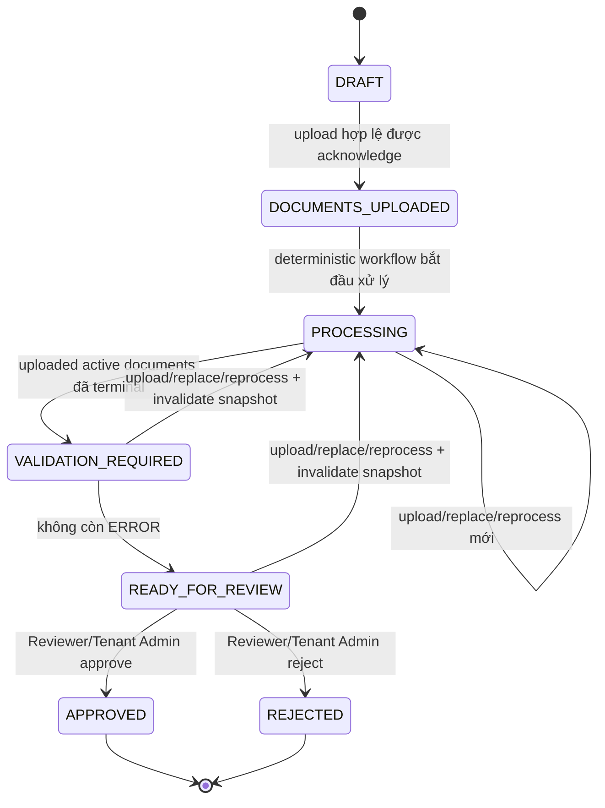
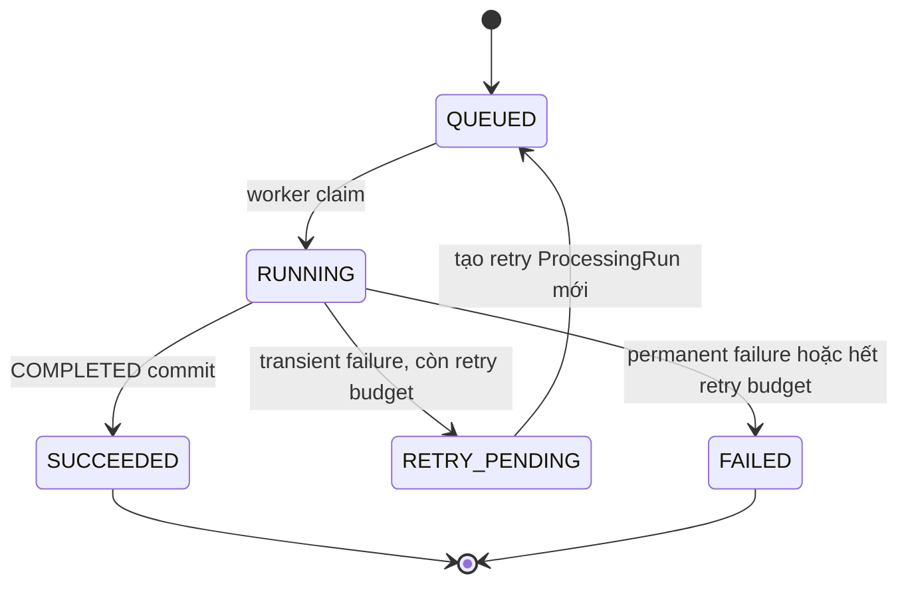
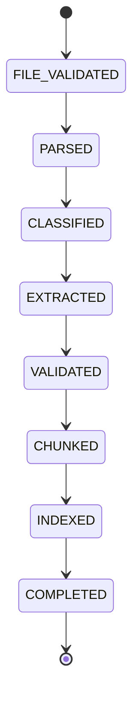
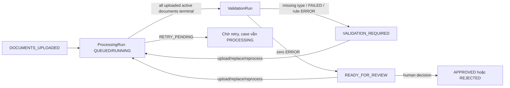

# State machines

## Nguyên tắc phân tách

`SupplierCase` business state trả lời “hồ sơ đang ở bước nghiệp vụ nào”.
`ProcessingRun` technical status trả lời “một lần xử lý tài liệu đang chạy ra
sao”. Hai state machine được lưu riêng. Model/Agent không sở hữu transition;
deterministic workflows thực thi precondition, optimistic locking và audit.

Lỗi parser/model/queue không bao giờ được ánh xạ thành business state
`REJECTED`. `REJECTED` chỉ là quyết định của Reviewer hoặc Tenant Admin.

## Business state của `SupplierCase`

### `DRAFT`

Case vừa tạo, chưa có upload hợp lệ. Operator, Reviewer hoặc Tenant Admin cùng
tenant có thể initial upload; API transaction tạo `Document`, initial
`ProcessingRun(QUEUED)` và `DocumentUploaded(run_id)`. Agent không được chuyển
state; reprocess không hợp lệ vì chưa có active document.

### `DOCUMENTS_UPLOADED`

Ít nhất một document hợp lệ đã được durable acknowledge; document set có thể
chưa đủ năm loại. `Document`, initial `ProcessingRun(QUEUED)` và
`DocumentUploaded(run_id)` đã commit, nhưng worker chưa được coi là hoàn tất.
Transition sang `PROCESSING` do deterministic workflow thực hiện, không phụ
thuộc client polling.

### `PROCESSING`

Các active documents đang được worker xử lý. Technical statuses được đọc riêng.
Một run `RETRY_PENDING`/`FAILED` giữ case quan sát được và recoverable; nó không
tạo `REJECTED`. Workflow không chờ đủ năm loại: khi mọi active document hiện đã
upload có current processing-lineage leaf là `SUCCEEDED` hoặc `FAILED`, nó tạo
validation snapshot. Historical `RETRY_PENDING` parent không chặn sau khi child
retry là current leaf. `FAILED` result và absent required types trở thành
deterministic `ERROR`, nên partial case không bị stranded ở `PROCESSING`.

### `VALIDATION_REQUIRED`

Deterministic `ValidationRun` đã đánh giá active document/processing snapshot.
Case ở lại state này khi thiếu required document/field, còn issue `ERROR` hoặc
input cần reprocess. `WARNING` cần reviewer xem nhưng không chặn;
`INFO` chỉ ghi chú. Khi không còn `ERROR` và required validation hoàn tất,
workflow mới chuyển `READY_FOR_REVIEW`.

Upload document còn thiếu, replacement hoặc authorized reprocess invalidate
active snapshot cùng affected result/index pointers, giữ records cũ cho audit,
tăng optimistic-lock version và chuyển case về `PROCESSING`. Một
`ValidationRun` mới được tạo sau khi tập active đã upload đạt terminal statuses.

### `READY_FOR_REVIEW`

Case đã qua deterministic gate và có snapshot/evidence để human review. Chỉ
Reviewer/Tenant Admin cùng tenant được gửi quyết định. Request phải mang
idempotency key, case optimistic-lock version và tham chiếu active validation
snapshot. Nếu state/version không còn đúng hoặc xuất hiện `ERROR`, server trả
`CASE_NOT_READY_FOR_REVIEW`; concurrent decision conflict trả `409`.

Policy cho phép upload document còn thiếu, replacement hoặc reprocess ở state
này. Cùng transaction phải clear active validation pointer, tăng case version và
chuyển về `PROCESSING`; do đó decision đồng thời không thể dùng stale snapshot.

### `APPROVED` và `REJECTED`

Terminal business decisions của con người, lưu bằng immutable
`ReviewDecision` và audit lineage. `APPROVED` không phải output của AI;
`REJECTED` không phải technical failure status.

### Transition guards

- Tất cả transition yêu cầu active membership và tenant/resource consistency ở
  use case khởi tạo action; workflow không tin client/model state.
- State update dùng compare-and-set/optimistic locking và append audit event.
- `VALIDATION_REQUIRED → READY_FOR_REVIEW` yêu cầu active `ValidationRun`, đủ
  required inputs và zero `ERROR`.
- Initial upload được phép ở `DRAFT`. Additional upload/replacement được phép ở
  `DOCUMENTS_UPLOADED`, `PROCESSING`, `VALIDATION_REQUIRED` và
  `READY_FOR_REVIEW`; reprocess dùng cùng nonterminal set nhưng yêu cầu active
  document. `APPROVED`/`REJECTED` từ chối mọi replacement/reprocess.
- Replacement/reprocess từ validation/review states phải atomically invalidate
  active validation cùng affected result/index pointers, tăng case version và
  re-enter `PROCESSING`. Reprocess ở `PROCESSING` bị conflict nếu cùng document
  còn run `QUEUED`, `RUNNING` hoặc `RETRY_PENDING`.
- `READY_FOR_REVIEW → APPROVED|REJECTED` yêu cầu Reviewer hoặc Tenant Admin;
  Operator và Agent luôn bị từ chối.
- Mọi transition ngoài đồ thị bị từ chối. Policy mở lại terminal case cần
  contract riêng trước khi triển khai; upload API không phải reopen shortcut.

## Technical status của `ProcessingRun`

Đường `RETRY_PENDING --> QUEUED` biểu diễn lineage giữa hai records: run hiện
tại giữ `RETRY_PENDING`, scheduler tạo một child `ProcessingRun` mới ở `QUEUED`.
Nó không mutate run cũ trở lại `QUEUED`. Duplicate RabbitMQ delivery không phải
retry và dùng cùng run/idempotency checkpoint, vì vậy không tạo record mới.
Scheduler atomically đổi `current_processing_run_id` sang child; validation gate
chỉ đọc leaf này, không đợi historical parent đổi status.

### `QUEUED`

Run đã được tạo với verified identifiers, `tenant_id`, `document_id`,
`pipeline_version` và retry lineage. Initial/reprocess run do API transaction tạo;
child retry run do scheduler tạo. Dispatcher chỉ publish `run_id`; worker chưa
sở hữu active lease và không tạo initial run.

### `RUNNING`

Worker đã claim run và xử lý/resume checkpoint. Lease/heartbeat ngăn hai worker
cùng commit một stage; idempotency constraints vẫn là lớp bảo vệ cuối.

### `SUCCEEDED`

Checkpoint `COMPLETED` và toàn bộ output cần thiết đã commit. Workflow có thể
atomically chọn run làm active successful result; chỉ một successful run được
active. Status này không tự đưa case tới `APPROVED`.

### `RETRY_PENDING`

Run gặp timeout, rate limit, service unavailable hoặc lỗi kết nối tạm thời và
còn budget. Error class, retry count và next-attempt schedule được lưu; scheduler
dùng exponential backoff + jitter và tạo child run. Tối đa **ba lần retry** sau
lần chạy đầu.

### `FAILED`

Run gặp permanent PDF/schema failure hoặc transient failure đã hết retry budget.
Message vào dead-letter queue khi chính sách yêu cầu. Reprocess phải đi qua API
authorization và tạo run mới; không đổi record `FAILED` thành `RUNNING` và không
đổi case thành `REJECTED`.

## Checkpoint state trong một run

Checkpoint chỉ tiến về trước trong cùng `pipeline_version`; stage output và
checkpoint commit atomically. Redelivery đọc checkpoint cuối của cùng
`run_id + checkpoint/stage` và resume stage kế tiếp. Output/checkpoint của
pipeline/schema version khác không được coi là hợp lệ cho run hiện hành.
Unique/upsert constraints theo run/checkpoint ngăn duplicate extracted
fields/evidence/chunks; `document_id + pipeline_version` chỉ được dùng cho
lineage và active-result comparison, không ngăn reprocess mới.

## Tương tác giữa hai state machine

- Business workflow có thể đọc aggregate technical outcomes nhưng không copy
  `FAILED` thành `REJECTED`.
- Validation luôn pin active document versions, terminal outcomes và active
  successful runs. Missing types/failed results tạo `ERROR`; một stale
  successful run không giúp case vượt gate.
- Mỗi document mới/replacement/reprocess invalidate active validation trước khi
  re-enter processing; historical snapshots vẫn audit-only.
- Validation commit compare-and-set case version/active set; concurrent document
  mutation buộc workflow evaluate lại thay vì activate stale snapshot.
- Agent chỉ đọc state/status/issues qua tools; không phát command transition.
- Audit nối upload, `ProcessingRun` lineage, `ValidationRun`, state transition
  và `ReviewDecision` bằng tenant/case/document/run identifiers.
