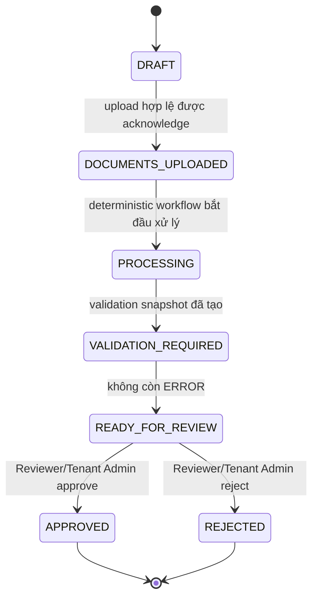
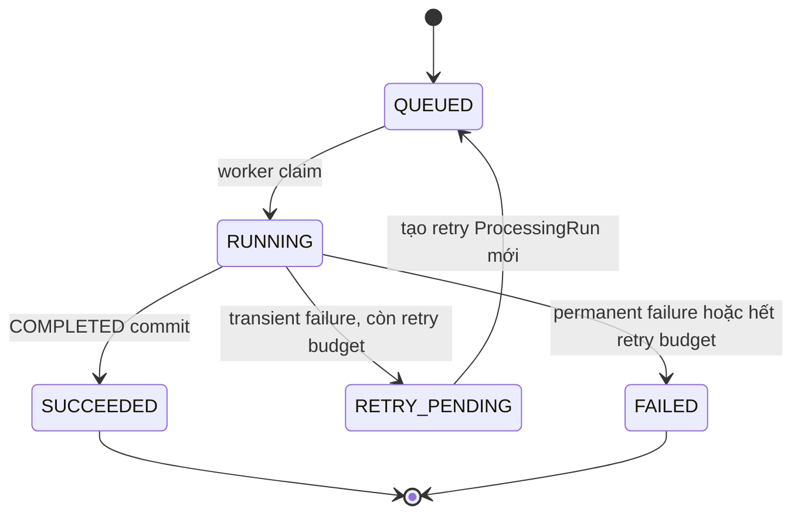
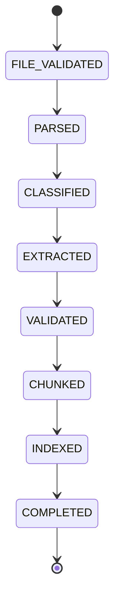
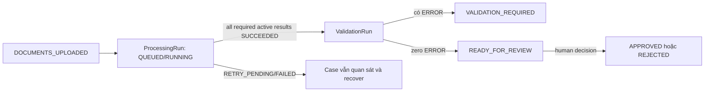

# State machines

## Nguyên tắc phân tách

`SupplierCase` business state trả lời “hồ sơ đang ở bước nghiệp vụ nào”.
`ProcessingRun` technical status trả lời “một lần xử lý tài liệu đang chạy ra
sao”. Hai state machine được lưu riêng. Model/Agent không sở hữu transition;
deterministic workflows thực thi precondition, optimistic locking và audit.

Lỗi parser/model/queue không bao giờ được ánh xạ thành business state
`REJECTED`. `REJECTED` chỉ là quyết định của Reviewer hoặc Tenant Admin.

## Business state của `SupplierCase`

### `DRAFT`

Case vừa tạo, chưa có upload hợp lệ. Operator, Reviewer hoặc Tenant Admin cùng
tenant có thể upload. Agent không được chuyển state.

### `DOCUMENTS_UPLOADED`

Ít nhất một document hợp lệ đã được durable acknowledge; document set có thể
chưa đủ năm loại. `Document` và `DocumentUploaded` đã commit, nhưng worker chưa
được coi là hoàn tất. Transition sang `PROCESSING` do deterministic workflow
thực hiện, không phụ thuộc client polling.

### `PROCESSING`

Các active documents đang được worker xử lý. Technical statuses được đọc riêng.
Một run `RETRY_PENDING`/`FAILED` giữ case quan sát được và recoverable; nó không
tạo `REJECTED`. Workflow chỉ tạo validation snapshot khi các input cần thiết ở
trạng thái phù hợp.

### `VALIDATION_REQUIRED`

Deterministic `ValidationRun` đã đánh giá active document/processing snapshot.
Case ở lại state này khi thiếu required document/field, còn issue `ERROR` hoặc
input cần reprocess. `WARNING` cần reviewer xem nhưng không chặn;
`INFO` chỉ ghi chú. Khi không còn `ERROR` và required validation hoàn tất,
workflow mới chuyển `READY_FOR_REVIEW`.

### `READY_FOR_REVIEW`

Case đã qua deterministic gate và có snapshot/evidence để human review. Chỉ
Reviewer/Tenant Admin cùng tenant được gửi quyết định. Request phải mang
idempotency key, case optimistic-lock version và tham chiếu active validation
snapshot. Nếu state/version không còn đúng hoặc xuất hiện `ERROR`, server trả
`CASE_NOT_READY_FOR_REVIEW`; concurrent decision conflict trả `409`.

### `APPROVED` và `REJECTED`

Terminal business decisions của con người, lưu bằng immutable
`ReviewDecision` và audit lineage. `APPROVED` không phải output của AI;
`REJECTED` không phải technical failure status.

### Transition guards

- Tất cả transition yêu cầu active membership và tenant/resource consistency ở
  use case khởi tạo action; workflow không tin client/model state.
- State update dùng compare-and-set/optimistic locking và append audit event.
- `VALIDATION_REQUIRED → READY_FOR_REVIEW` yêu cầu active `ValidationRun`, đủ
  required inputs và zero `ERROR`.
- `READY_FOR_REVIEW → APPROVED|REJECTED` yêu cầu Reviewer hoặc Tenant Admin;
  Operator và Agent luôn bị từ chối.
- Mọi transition ngoài đồ thị bị từ chối; document replacement/reprocess không
  được tự phát minh backward transition. Policy mở lại case cần contract riêng
  trước khi triển khai.

## Technical status của `ProcessingRun`

Đường `RETRY_PENDING --> QUEUED` biểu diễn lineage giữa hai records: run hiện
tại giữ `RETRY_PENDING`, scheduler tạo một child `ProcessingRun` mới ở `QUEUED`.
Nó không mutate run cũ trở lại `QUEUED`. Duplicate RabbitMQ delivery không phải
retry và dùng cùng run/idempotency checkpoint, vì vậy không tạo record mới.

### `QUEUED`

Run đã được tạo với verified identifiers, `tenant_id`, `document_id`,
`pipeline_version` và retry lineage. Chưa có worker sở hữu active lease.

### `RUNNING`

Worker đã claim run và xử lý/resume checkpoint. Lease/heartbeat ngăn hai worker
cùng commit một stage; idempotency constraints vẫn là lớp bảo vệ cuối.

### `SUCCEEDED`

Checkpoint `COMPLETED` và toàn bộ output cần thiết đã commit. Workflow có thể
atomically chọn run làm active successful result; chỉ một successful run được
active. Status này không tự đưa case tới `APPROVED`.

### `RETRY_PENDING`

Run gặp timeout, rate limit, service unavailable hoặc lỗi kết nối tạm thời và
còn budget. Error class, retry count và next-attempt schedule được lưu; scheduler
dùng exponential backoff + jitter và tạo child run. Tối đa **ba lần retry** sau
lần chạy đầu.

### `FAILED`

Run gặp permanent PDF/schema failure hoặc transient failure đã hết retry budget.
Message vào dead-letter queue khi chính sách yêu cầu. Reprocess phải đi qua API
authorization và tạo run mới; không đổi record `FAILED` thành `RUNNING` và không
đổi case thành `REJECTED`.

## Checkpoint state trong một run

Checkpoint chỉ tiến về trước trong cùng `pipeline_version`; stage output và
checkpoint commit atomically. Redelivery đọc checkpoint cuối và resume stage kế
tiếp. Output/checkpoint của pipeline/schema version khác không được coi là hợp
lệ cho run hiện hành. Khóa `document_id + pipeline_version` cùng unique/upsert
constraints ngăn duplicate extracted fields/evidence/chunks.

## Tương tác giữa hai state machine

- Business workflow có thể đọc aggregate technical outcomes nhưng không copy
  `FAILED` thành `REJECTED`.
- Validation luôn pin active document versions và active successful runs. Một
  stale successful run không giúp case vượt gate.
- Agent chỉ đọc state/status/issues qua tools; không phát command transition.
- Audit nối upload, `ProcessingRun` lineage, `ValidationRun`, state transition
  và `ReviewDecision` bằng tenant/case/document/run identifiers.
