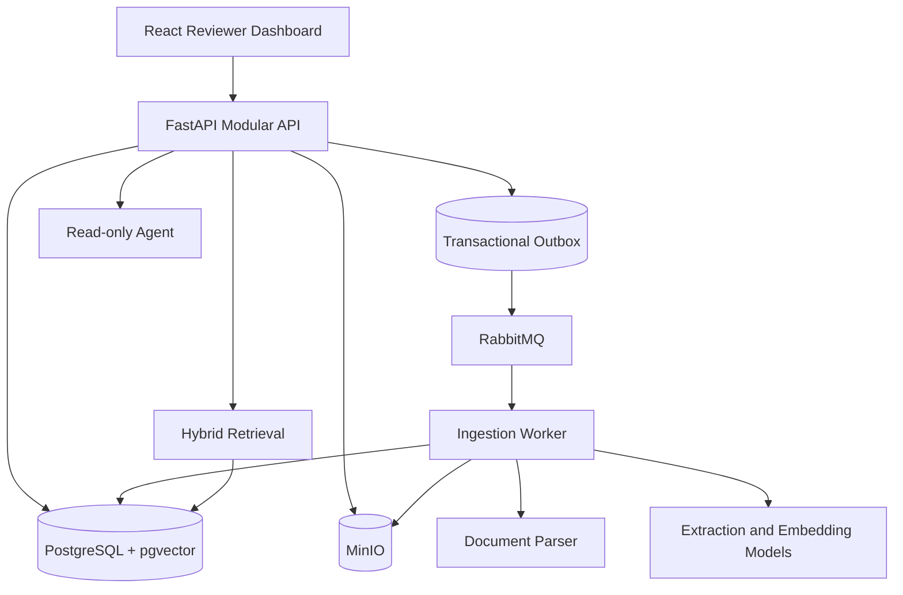
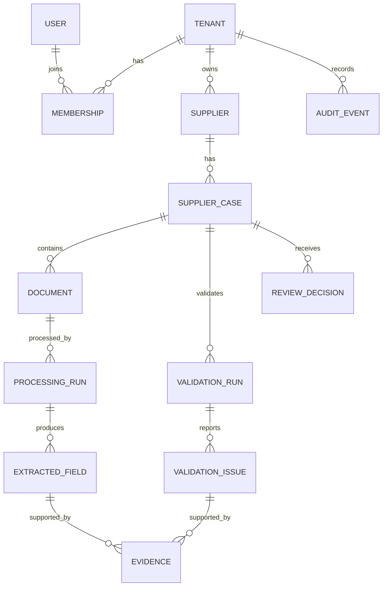

# Enterprise Document Agent — Design Specification

## 1. Mục tiêu

`enterprise-document-agent` là capstone giúp một doanh nghiệp tiếp nhận, kiểm tra và review hồ sơ onboarding nhà cung cấp. Hệ thống xử lý tài liệu bất đồng bộ, trích xuất dữ liệu có cấu trúc, kiểm tra các quy tắc xác định, hỗ trợ hỏi đáp có citation và giữ con người ở vị trí quyết định cuối cùng.

Project nằm tại `capstone/enterprise-document-agent/` trong repository `Knowledge-And-Practice`, nhưng phải tự chứa source code, dependency, test, Docker configuration và tài liệu để có thể tách thành repository riêng sau này.

## 2. Phạm vi sản phẩm

### Người dùng

- `Operator`: tạo supplier/case, upload hoặc thay tài liệu, xem kết quả xử lý.
- `Reviewer`: có quyền của Operator và được approve/reject case.
- `Tenant Admin`: quản lý membership, xem audit và có toàn bộ quyền review.

### Bộ tài liệu MVP

Mỗi `SupplierCase` xử lý năm loại PDF tiếng Anh:

1. `company_profile`
2. `business_registration`
3. `tax_registration`
4. `bank_information_form`
5. `quotation`

MVP chỉ nhận PDF, tối đa 20 MB và 50 trang mỗi file. Tài liệu corrupted, password-protected hoặc không đúng định dạng bị từ chối rõ ràng.

### Human-in-the-loop

AI phân loại, trích xuất, tìm evidence và tạo cảnh báo. Deterministic rule engine quyết định rule nào pass/fail. Chỉ Reviewer hoặc Tenant Admin được approve/reject. Agent không được thay đổi dữ liệu hoặc trạng thái case.

### Ngoài phạm vi MVP

- Tự động approve/reject.
- Agent có write tools.
- Multi-agent workflow.
- MCP server.
- Tài liệu song ngữ.
- Kubernetes và multi-region.
- Billing, subscription và quản trị SaaS đầy đủ.
- Microservices cho từng domain.

## 3. Mục tiêu quy mô và chất lượng

Demo dùng một tenant, 3–5 users, 20 suppliers và khoảng 100 PDF synthetic. Kiến trúc được thiết kế cho 10 tenants, 100 users mỗi tenant, 1.000 cases mỗi tenant, trung bình năm documents mỗi case, khoảng 1.000 uploads/ngày, peak 20 uploads/phút và 50 chat requests đồng thời.

Mục tiêu ban đầu:

- Upload acknowledgement P95 dưới 500 ms, không tính thời gian truyền file.
- Document processing P95 dưới hai phút.
- Retrieval P95 dưới một giây.
- Chat không streaming P95 dưới 10 giây.
- Availability target 99,5%.
- Không mất document đã xác nhận upload.
- Không tạo extraction hoặc chunk trùng khi worker retry.
- Tenant-isolation security tests đạt 100%.

## 4. Kiến trúc tổng thể

Kiến trúc là modular monolith + asynchronous worker, local-first qua adapters.



Ba application process của MVP:

- `web`: React + TypeScript + Vite.
- `api`: FastAPI stateless API.
- `worker`: xử lý ingestion bất đồng bộ.

PostgreSQL, MinIO và RabbitMQ là infrastructure dependencies. Agent là module trong API, không phải service riêng. API và worker dùng chung domain/application core.

## 5. Ranh giới source code

```text
capstone/enterprise-document-agent/
├── README.md
├── AGENTS.md
├── .env.example
├── compose.yml
├── Makefile
├── apps/
│   ├── web/
│   ├── api/
│   └── worker/
├── packages/
│   ├── core/
│   ├── contracts/
│   └── adapters/
├── migrations/
├── infrastructure/{local,azure}/
├── evaluation/{datasets,ground-truth,metrics,reports}/
├── tests/{integration,end-to-end,security,performance}/
└── docs/
```

`packages/core` chứa domain và application use cases, không import FastAPI, SQLAlchemy hoặc Azure SDK. `packages/contracts` chứa schemas, event contracts và port interfaces. `packages/adapters` cung cấp local và Azure implementations.

Các port chính:

- `ObjectStorage`
- `MessageQueue`
- `DocumentParser`
- `ExtractionModel`
- `EmbeddingModel`
- `SearchIndex`
- `LanguageModel`
- `IdentityProvider`
- `AuditPublisher`

Capstone không import code từ `learning-paths/`, `resources/` hoặc thư mục ngoài capstone.

## 6. Domain model



Mọi bảng nghiệp vụ chứa `tenant_id`. Document mới không ghi đè version cũ; version trước được giữ để audit. Mỗi retry/reprocess tạo `ProcessingRun` riêng, nhưng chỉ một run thành công được chọn làm kết quả active.

Business state của case:

```text
DRAFT → DOCUMENTS_UPLOADED → PROCESSING
      → VALIDATION_REQUIRED → READY_FOR_REVIEW
      → APPROVED hoặc REJECTED
```

Processing status được lưu riêng:

```text
QUEUED → RUNNING → SUCCEEDED
                 ├→ RETRY_PENDING
                 └→ FAILED
```

Lỗi kỹ thuật không được biến thành business status `REJECTED`.

## 7. Ingestion, retry và idempotency

API xác thực user, active membership, role, tenant ownership và case state. Sau đó API validate PDF, stream file vào object storage, tính SHA-256, tạo `Document` và `DocumentUploaded` outbox event trong cùng transaction, rồi trả `202 Accepted` cùng `document_id` và `status_url`.

Outbox publisher gửi message chỉ chứa identifiers đã xác minh, không chứa PDF binary. RabbitMQ dùng at-least-once delivery. `Idempotency-Key` ở API chống lặp user intent; worker dedupe theo `run_id + checkpoint/stage`, còn `document_id + pipeline_version` chỉ giữ lineage/active-result comparison và không suppress reprocess mới.

Checkpoint:

```text
FILE_VALIDATED → PARSED → CLASSIFIED → EXTRACTED
→ VALIDATED → CHUNKED → INDEXED → COMPLETED
```

Timeout, rate limit, service unavailable và lỗi kết nối tạm thời được retry tối đa ba lần với exponential backoff + jitter. Lỗi PDF vĩnh viễn hoặc schema vẫn sai sau controlled repair không được retry vô hạn; message chuyển dead-letter queue khi vượt giới hạn.

## 8. Extraction và deterministic validation

Pipeline:

```text
Parse/OCR → classify → select versioned schema
→ structured extraction → schema validation
→ normalization → confidence check
→ deterministic cross-document rules
→ issues + evidence
```

Giữ đồng thời `raw_value`, `normalized_value`, confidence và evidence. Critical fields gồm legal name, registration number, tax ID, account holder, account number, quotation total và quotation validity.

Severity:

- `ERROR`: chặn `READY_FOR_REVIEW`.
- `WARNING`: reviewer cần xem nhưng không chặn.
- `INFO`: ghi chú, không chặn.

Rule engine chịu trách nhiệm completeness, required fields, format, cross-document consistency, quotation validity/calculation, confidence và duplicate/version rules. LLM không quyết định severity hoặc case status.

## 9. Retrieval, citation và Agent

Chunking theo heading, paragraph, key-value group, table rows, quotation items, form sections và page boundary. Mỗi chunk có `tenant_id`, `case_id`, `document_id`, document type, version, page, section và bounding regions.

Retrieval ban đầu:

```text
keyword/BM25 + vector search + mandatory metadata filter
→ top 20 candidates → rerank → top 5 context
```

Các giá trị top-k là configuration và được điều chỉnh bằng evaluation.

Agent chỉ có read-only tools:

- `get_case_summary`
- `list_case_documents`
- `get_document_metadata`
- `get_extracted_fields`
- `list_validation_issues`
- `search_case_evidence`
- `explain_validation_issue`

Tool nhận authentication context từ server; model không được truyền `tenant_id` tùy ý. Mọi retrieval bắt buộc filter `tenant_id + case_id + active document`.

Citation gồm document, page, evidence snippet và bounding region khi parser cung cấp. Backend xác minh citation tồn tại, thuộc đúng tenant/case, trỏ tới active document và snippet thuộc đúng page/chunk. Khi evidence không đủ hoặc citation không hợp lệ, Agent trả refusal thay vì suy đoán.

Nội dung PDF là untrusted data. Chỉ system instruction và tools đăng ký mới điều khiển Agent. Agent có giới hạn bước, timeout, token và cost budget.

## 10. API, authorization và frontend

API prefix là `/api/v1`. Nhóm endpoint bao gồm auth/me, suppliers, supplier cases, documents/status/evidence/reprocess, extracted fields, validation issues, case chat, review decisions và audit events.

API không dùng `tenant_id` trong request body làm nguồn quyền hạn. Mỗi request kiểm tra authenticated user, active membership, role permission, resource tenant và resource state. Review dùng idempotency key và optimistic locking; conflict trả `409`.

Error format:

```json
{
  "error": {
    "code": "CASE_NOT_READY_FOR_REVIEW",
    "message": "The supplier case contains blocking validation issues.",
    "request_id": "req_123"
  }
}
```

Frontend tổ chức theo các feature `auth`, `suppliers`, `cases`, `documents`, `validation`, `review`, `agent` và `audit`. Dashboard gồm login, case list, upload, processing status, extracted fields, issues, PDF evidence viewer, grounded chat, approve/reject và audit timeline. TanStack Query quản lý server state; TypeScript API client được sinh từ OpenAPI sau khi contract ổn định.

## 11. Security và failure isolation

- Tenant isolation áp dụng cho database, object path, queue message, search filter, cache key, logs và Agent tools.
- Bank account được mã hóa khi lưu và masked khi hiển thị; log/trace không chứa giá trị đầy đủ.
- Storage key do server tạo; không tin filename từ client.
- Không ghi secret, token, document text đầy đủ hoặc prompt nhạy cảm vào log.
- Signed URL có thời hạn ngắn; authorization được kiểm tra ở application layer.
- Agent lỗi không làm hỏng upload, extraction hoặc review.
- Search index có thể rebuild từ PostgreSQL và object storage.
- PDF gốc và metadata database là nguồn khôi phục chính; queue không phải source of truth.

## 12. Testing, evaluation và observability

Testing gồm unit, integration với services thật trong container, API contract, React component, end-to-end, security, failure và performance tests. Rule engine dùng fixtures xác định và phải đạt 100% trên deterministic test cases.

Synthetic dataset gồm khoảng 20 suppliers × 5 document types, tách theo supplier thành development, validation và final test để tránh leakage. Ground truth chứa document type, fields, normalized values, evidence, expected issues, case status, questions, answers, citations, unanswerable questions và expected tool.

Metrics mục tiêu:

- Document classification macro F1 ≥ 0,90.
- Field extraction F1 ≥ 0,85.
- Critical-field recall ≥ 0,95.
- Retrieval Recall@5 ≥ 0,90.
- Citation correctness ≥ 0,90.
- Answer faithfulness ≥ 0,90.
- Correct refusal ≥ 0,85.
- Agent tool-selection accuracy ≥ 0,90.
- Tenant isolation 100% security tests pass.

Structured logs chứa request/trace/tenant/case/document/run identifiers, event, duration và error code. Metrics theo dõi API latency, queue depth/job age, processing stages, retry rate, retrieval zero-result, tokens/cost, Agent steps, case states và unauthorized attempts. Trace ingestion nối API → outbox → queue → worker → external AI service.

## 13. Local và Azure mapping

Local stack dùng React/Vite, FastAPI, PostgreSQL 16 + pgvector, MinIO, RabbitMQ, PyMuPDF, local JWT và model provider adapters. Mock/fake models được dùng trong deterministic tests; Azure Foundry không phải dependency bắt buộc để chạy local.

Azure mapping:

```text
React/FastAPI/worker containers → Azure Container Apps
PostgreSQL                     → Azure Database for PostgreSQL
MinIO                          → Azure Blob Storage
RabbitMQ                       → Azure Service Bus
PyMuPDF parser                 → Azure Document Intelligence adapter
pgvector                       → Azure AI Search adapter
Model provider                 → Microsoft Foundry/Azure OpenAI adapter
Local JWT                      → Microsoft Entra ID
Local secrets                  → Azure Key Vault
Local telemetry                → Azure Monitor/Application Insights
Container images               → Azure Container Registry
```

Business logic không import Azure SDK. Azure deployment chỉ bắt đầu sau khi local MVP có evaluation baseline.

## 14. Tài liệu project

Project tạo các nhóm tài liệu:

- `requirements/`: product, functional và non-functional requirements.
- `architecture/`: system overview, ingestion, extraction/validation và retrieval/Agent.
- `data-model/`: domain model và state machines.
- `api/`: API contract và authorization matrix.
- `security/`: security model và failure modes.
- `evaluation/`: dataset và evaluation strategy.
- `operations/`: local development, observability và Azure mapping.
- `decisions/`: ADR cho modular monolith, local-first adapters, human-in-the-loop, deterministic rule engine và read-only Agent.

Mỗi tài liệu phải hoàn chỉnh, là một góc nhìn tập trung của specification này và liên kết tới tài liệu liên quan.

## 15. Milestones

1. `M0 Foundation`: repository, tài liệu, Compose, CI và health checks.
2. `M1 Core domain`: local auth, tenancy/RBAC, supplier/case/document, migrations.
3. `M2 Reliable ingestion`: storage, outbox, RabbitMQ, worker, retry, checkpoints và idempotency.
4. `M3 Document intelligence`: classification, extraction, evidence, normalization và validation.
5. `M4 RAG and Agent`: chunking, hybrid retrieval, reranking, citation validation và read-only tools.
6. `M5 Human review`: dashboard, PDF highlight, approve/reject, optimistic locking và audit.
7. `M6 Evaluation and hardening`: synthetic dataset, layered evaluation, security/failure/load tests và telemetry.
8. `M7 Azure deployment`: IaC, Azure adapters, identity, secrets, CI/CD, monitoring và cost controls.

Mỗi milestone phải có hướng dẫn chạy, tests và evidence. Milestone sau không được che giấu failure của milestone trước.

## 16. Tiêu chí nghiệm thu MVP

Một Operator có thể đăng nhập, tạo supplier/case, upload năm PDF và nhận `202` trong giới hạn latency. Worker xử lý bất đồng bộ mà không tạo duplicate khi redelivery, trích xuất dữ liệu/evidence, chạy deterministic validation và cập nhật trạng thái. Reviewer xem được tài liệu, evidence, issue và grounded chat; sau đó approve/reject với audit record. Cross-tenant access luôn bị từ chối. Evaluation report xác định chất lượng từng tầng thay vì chỉ đánh giá câu trả lời cuối.
