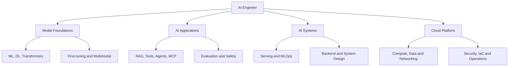
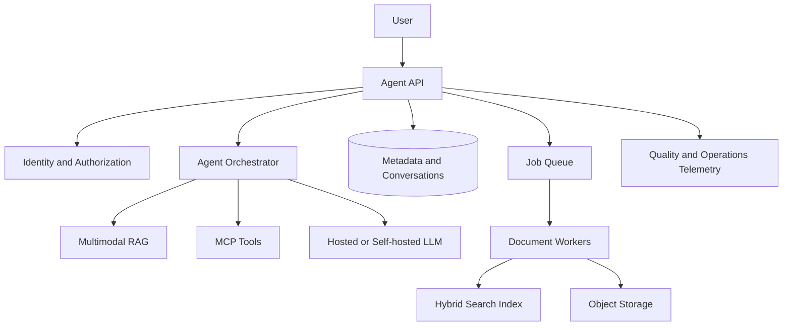
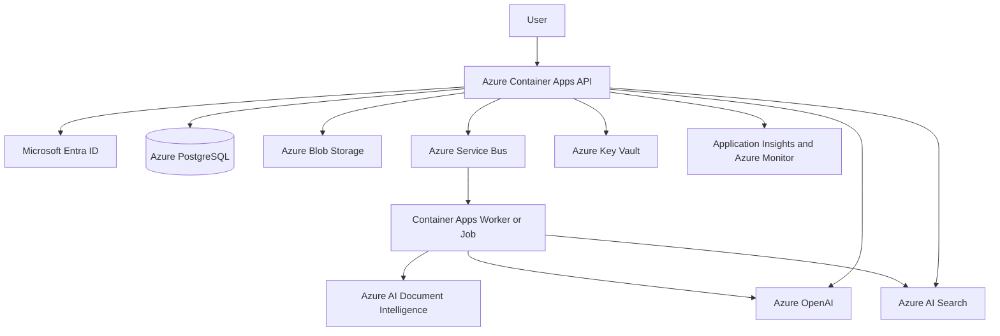

# LỘ TRÌNH AI ENGINEER NÂNG CAO VÀ CLOUD ENGINEERING

## Chương trình 20 tuần: từ RAG/AI Agent đến Multimodal, Fine-tuning, LLM Serving và Azure Production

**Đối tượng:** AI Engineer Intern đã có kiến thức Python, ML cơ bản, RAG và chatbot  
**Thời lượng đề xuất:** 20 tuần, 10–14 giờ mỗi tuần  
**Định hướng:** Applied AI/Agent Engineer có năng lực Cloud và AI Systems  
**Cloud chính:** Microsoft Azure  
**Nguyên tắc:** học khái niệm cloud-neutral trước, ánh xạ sang Azure sau  

---

## Mục lục

1. Mục tiêu nghề nghiệp và cách sử dụng tài liệu
2. Bản đồ năng lực AI Engineer hiện đại
3. Những gì RAG đã cung cấp và phần còn thiếu
4. Capstone project xuyên suốt
5. Kế hoạch tổng thể 20 tuần
6. Giai đoạn A – Nền tảng Deep Learning và Transformer
7. Giai đoạn B – LLM Application Engineering
8. Giai đoạn C – AI Agent, MCP và Agent Security
9. Giai đoạn D – Evaluation, Observability và AI Quality
10. Giai đoạn E – Multimodal và Document AI
11. Giai đoạn F – Fine-tuning, PEFT và Dataset Engineering
12. Giai đoạn G – LLM Inference và Serving
13. Cloud fundamentals dành cho AI Engineer
14. Azure fundamentals và quản trị tài nguyên
15. Cloud networking và identity
16. Cloud storage, database, queue và cache
17. Compute, container và serverless
18. Azure AI stack cho RAG/Agent
19. Infrastructure as Code và CI/CD
20. Cloud observability, reliability và disaster recovery
21. Cloud security và responsible AI
22. FinOps và tối ưu chi phí
23. Kiến trúc capstone trên Azure
24. Repository structure
25. Checklist nghiệm thu
26. Portfolio và phỏng vấn
27. Lộ trình sau 20 tuần
28. Nguồn học chính thức

---

# 1. Mục tiêu nghề nghiệp và cách sử dụng tài liệu

Mục tiêu không phải học càng nhiều framework càng tốt. Sau chương trình, người học cần thể hiện được năng lực xây một AI product qua toàn bộ vòng đời:

```text
Problem definition
→ Data and evaluation design
→ Model/LLM selection
→ RAG, tools and agent workflow
→ Backend and system design
→ Cloud infrastructure
→ Deployment and observability
→ Security, reliability and cost
→ Continuous evaluation and improvement
```

## 1.1 Kết quả kỳ vọng

Sau 20 tuần, bạn cần có khả năng:

- Giải thích Transformer và cơ chế generation ở mức kỹ sư ứng dụng.
- Thiết kế structured output, tool calling và context engineering.
- Xây agent workflow có state, permission, retry và step budget.
- Xây MCP server/client an toàn cho internal tools.
- Thiết kế bộ evaluation cho RAG, agent và model.
- Xử lý document đa phương thức gồm text, layout, table và image.
- Fine-tune model nhỏ bằng LoRA/QLoRA cho task hẹp.
- Serve model open-source và đo inference performance.
- Triển khai API, worker, database, storage và AI services trên Azure.
- Sử dụng identity, RBAC, network controls và secret management.
- Viết Infrastructure as Code và pipeline CI/CD.
- Theo dõi logs, metrics, traces, quality và cost.
- Thiết kế reliability, backup và recovery.
- Trình bày trade-off giữa managed service và self-hosting.

## 1.2 Cách học

Mỗi module cần tạo ít nhất bốn loại đầu ra:

1. **Knowledge note:** giải thích bằng lời của bản thân.
2. **Artifact:** code, diagram, dataset hoặc infrastructure template.
3. **Measurement:** accuracy, latency, cost, throughput hoặc error rate.
4. **Decision record:** vì sao chọn phương án và khi nào đánh giá lại.

Không hoàn thành module nếu chỉ xem video hoặc đọc tài liệu.

---

# 2. Bản đồ năng lực AI Engineer hiện đại



## 2.1 Mô hình chữ T phù hợp

### Chiều sâu chính

- Production RAG.
- AI Agent và tool integration.
- Document/enterprise AI.
- Evaluation và observability.

### Chiều rộng bắt buộc

- ML/DL/Transformer fundamentals.
- Backend và system design.
- Cloud deployment.
- Security.
- LLM inference.
- Fine-tuning ở mức thực hành.
- Multimodal AI.

### Chiều sâu tùy chọn sau này

- AI platform/LLMOps.
- Model training/fine-tuning.
- Computer vision/video retrieval.
- Distributed inference.

---

# 3. Những gì RAG đã cung cấp và phần còn thiếu

## RAG giúp bạn học

- Embedding và semantic similarity.
- Vector search.
- Data ingestion.
- Chunking và metadata.
- Prompt với external context.
- Citation và grounding.
- Backend integration.

## RAG cơ bản chưa bao phủ đủ

- Transformer hoạt động thế nào.
- Model training và adaptation.
- Tool calling và agent state.
- Evaluation có hệ thống.
- Multimodal understanding.
- GPU inference và model serving.
- Cloud networking, IAM và infrastructure.
- MLOps và release lifecycle.
- Security của agent/tool.
- Cost engineering.

Do đó, không bỏ RAG. Hãy biến RAG thành trục project, sau đó gắn các năng lực còn thiếu vào cùng một hệ thống.

---

# 4. Capstone project xuyên suốt

## Tên project

**Cloud-Native Multimodal Enterprise Document Agent**

## Tính năng

- Upload PDF, DOCX, image và scanned document.
- Phát hiện file protected/corrupted/unsupported.
- Parse text, layout, table và page image.
- Document classification.
- Hybrid retrieval và reranking.
- Hỏi đáp có citation theo trang/section.
- Agent sử dụng tools theo quyền.
- MCP server expose document tools.
- Evaluation pipeline và quality dashboard.
- Optional fine-tuned small model cho classification/router.
- Optional self-hosted LLM/embedding endpoint.
- Multi-tenant access control.
- Cloud deployment bằng Infrastructure as Code.
- CI/CD, logs, metrics, traces và cost dashboard.

## Kiến trúc logic



---

# 5. Kế hoạch tổng thể 20 tuần

| Tuần | Chủ đề | Sản phẩm chính |
|---:|---|---|
| 1 | PyTorch và Deep Learning review | Training pipeline nhỏ |
| 2 | Transformer và LLM fundamentals | Notebook giải thích attention/generation |
| 3 | Structured output và context engineering | Reliable extraction service |
| 4 | Tool calling và workflow | Tool-using assistant |
| 5 | AI Agent architecture | Stateful bounded agent |
| 6 | MCP và agent security | Secure document MCP server |
| 7 | RAG/LLM evaluation | Versioned evaluation suite |
| 8 | Agent evaluation và observability | Trace + quality dashboard |
| 9 | Multimodal và Document AI | Layout/image-aware ingestion |
| 10 | Advanced retrieval | Hybrid, rerank, routing experiments |
| 11 | Dataset engineering và LoRA | Fine-tuned classifier/router |
| 12 | Quantization và inference serving | vLLM/local endpoint benchmark |
| 13 | Cloud fundamentals và Azure governance | Resource map + sandbox environment |
| 14 | Networking, identity và secrets | Secure cloud access design |
| 15 | Cloud data services | Storage/database/queue deployment |
| 16 | Containers, compute và autoscaling | API + worker on Azure |
| 17 | Azure AI services integration | Cloud RAG end-to-end |
| 18 | IaC và CI/CD | Reproducible deployment pipeline |
| 19 | Observability, reliability và security | Dashboards, alerts, recovery test |
| 20 | FinOps, evaluation gate và portfolio | Final report and demo |

## Thời gian biểu tuần

- 2–3 giờ đọc và ghi chú.
- 5–7 giờ code/lab.
- 2 giờ test và đo đạc.
- 1–2 giờ viết documentation/ADR.

---

# 6. Giai đoạn A – Nền tảng Deep Learning và Transformer

## Tuần 1 – PyTorch và Deep Learning review

### Kiến thức

- Tensor, shape, dtype và device.
- Autograd và computation graph.
- Forward/backward pass.
- Loss function.
- Optimizer: SGD, Adam, AdamW.
- Learning rate và scheduler.
- Batch, epoch và gradient accumulation.
- Regularization, dropout, weight decay.
- Train/validation/test.
- Checkpoint và reproducibility.
- Mixed precision ở mức khái niệm và thực hành.

### Thực hành

1. Xây text classifier nhỏ bằng PyTorch.
2. Tạo Dataset/DataLoader.
3. Viết training và validation loop.
4. Log loss, accuracy/F1 và learning rate.
5. Save best checkpoint.
6. Thử ít nhất hai learning rate.
7. Phân tích 20 prediction sai.

### Câu hỏi cần trả lời

- Tại sao validation loss tăng khi training loss giảm?
- Vì sao accuracy không đủ cho dữ liệu imbalance?
- `model.train()` và `model.eval()` khác gì?
- Gradient accumulation ảnh hưởng effective batch size thế nào?
- Mixed precision giúp gì và có rủi ro gì?

### Đầu ra

- Reproducible training script.
- Experiment table.
- Error analysis report.
- Model card ngắn.

## Tuần 2 – Transformer và LLM fundamentals

### Kiến thức

- Tokenizer và vocabulary.
- Embedding layer.
- Positional information.
- Self-attention.
- Query, Key, Value.
- Scaled dot-product attention.
- Multi-head attention.
- Feed-forward block.
- Residual connection và normalization.
- Encoder, decoder và decoder-only model.
- Causal mask.
- Autoregressive generation.
- Context window.
- Greedy, temperature, top-k, top-p.
- KV cache.
- Prefill và decode.
- Pretraining, instruction tuning và preference alignment.

### Thực hành

1. Quan sát tokenizer của một model nhỏ.
2. So sánh số token giữa tiếng Việt và tiếng Anh.
3. Visualize attention trên ví dụ nhỏ nếu công cụ cho phép.
4. Chạy model với greedy, temperature và top-p khác nhau.
5. Đo time-to-first-token và tokens/second.
6. Thay đổi context length và quan sát latency/memory.

### Công thức trọng tâm

$$
\operatorname{Attention}(Q,K,V)=\operatorname{softmax}\left(\frac{QK^T}{\sqrt{d_k}}\right)V
$$

Không cần thuộc mọi phép biến đổi, nhưng phải giải thích được ý nghĩa của similarity, scaling và weighted combination.

### Đầu ra

- Notebook LLM fundamentals.
- Decoding comparison report.
- Một trang giải thích KV cache và context cost.

---

# 7. Giai đoạn B – LLM Application Engineering

## Tuần 3 – Structured output và context engineering

### Structured output

- JSON Schema.
- Required/optional fields.
- Enum và nested object.
- Validation bằng Pydantic.
- Model refusal và parsing failure.
- Retry policy.
- Versioned schema.
- Compatibility khi schema thay đổi.

### Context engineering

Context có thể bao gồm:

- System policy.
- User request.
- Conversation summary.
- Retrieved evidence.
- Tool descriptions.
- Tool outputs.
- User/tenant permissions.
- Current workflow state.

### Nguyên tắc

- Chỉ đưa context cần thiết.
- Phân biệt trusted instruction và untrusted data.
- Giữ provenance/citation.
- Có token budget cho từng phần.
- Không để history tăng vô hạn.
- Có strategy summarize/truncate.
- Đo tác động của context ordering.

### Project

Document classifier trả structured output:

```json
{
  "document_type": "invoice",
  "confidence": 0.94,
  "evidence": [
    {"page": 1, "text": "Invoice Number"}
  ],
  "needs_human_review": false
}
```

Đánh giá schema-valid rate, accuracy, latency và token usage.

## Tuần 4 – Tool calling và deterministic workflow

### Tool contract

- Name và description.
- Input/output schema.
- Authentication context.
- Permission requirement.
- Read-only hay side effect.
- Timeout.
- Retry.
- Idempotency.
- Audit event.

### Workflow trước Agent

Xây workflow:

```text
Classify intent
→ Select allowed document scope
→ Retrieve
→ Optional calculation/tool
→ Generate answer
→ Validate output
```

### Tools thực hành

- `search_documents`
- `get_document_metadata`
- `get_page_text`
- `calculate`
- `get_processing_status`

### Test

- Chọn đúng tool.
- Argument đúng schema.
- Tool timeout.
- Tool trả empty result.
- User không có permission.
- Model cố gọi tool không tồn tại.
- Duplicate side-effect call.

---

# 8. Giai đoạn C – AI Agent, MCP và Agent Security

## Tuần 5 – Agent architecture

### Kiến thức

- Agent loop.
- Router.
- Planner/executor.
- State machine.
- Short-term memory.
- Long-term memory và điều kiện cần thiết.
- Human-in-the-loop.
- Step budget.
- Token/cost budget.
- Deadline và cancellation.
- Failure recovery.

### Phân biệt workflow và agent

| Workflow | Agent |
|---|---|
| Bước được định nghĩa trước | Bước được chọn động |
| Dễ test và dự đoán | Linh hoạt hơn |
| Latency/cost ổn định hơn | Có nguy cơ loop |
| Phù hợp quy trình chặt | Phù hợp nhiệm vụ mở |

Ưu tiên workflow; chỉ đặt agent ở bước cần quyết định động.

### Boundaries bắt buộc

- Maximum 5–8 steps cho lab.
- Overall timeout.
- Max tool calls.
- Repeated-call detection.
- Tool allowlist theo user.
- No hidden privilege escalation.
- Explicit stop reason.
- Trace toàn bộ decision/tool.

### Bài tập

Xây agent nhận câu hỏi tài liệu, có thể:

- Tìm document.
- Lấy metadata.
- Đọc trang cụ thể.
- So sánh hai tài liệu.
- Tính toán từ dữ liệu đã trích xuất.

Không cho agent gửi email, xóa dữ liệu hoặc thực hiện hành động ngoài scope.

## Tuần 6 – MCP và Agent Security

### MCP cần học

- Client, server và host.
- Tool discovery.
- Tool schema.
- Resources/context concepts.
- Transport và stateless/stateful implications.
- Authentication/authorization.
- Error model.
- Inspector và testing.

### MCP server project

Expose:

- `list_documents`
- `search_documents`
- `get_document_page`
- `classify_document`
- `get_job_status`

### Security cases

- Confused deputy.
- Token forwarding sai.
- Cross-tenant resource access.
- Prompt injection yêu cầu gọi tool trái quyền.
- Tool description poisoning.
- Excessive permission.
- Sensitive tool result leakage.
- Untrusted MCP server.

### Nghiệm thu

- Tool schema validation.
- User identity không lấy từ model argument.
- Authorization tại server.
- Audit log.
- Timeout/retry rõ.
- Security tests.

---

# 9. Giai đoạn D – Evaluation, Observability và AI Quality

## Tuần 7 – RAG và LLM evaluation

### Dataset

Tạo 50–100 examples gồm:

- Single-hop.
- Multi-hop.
- Exact entity/code.
- Semantic paraphrase.
- Table/layout.
- Unanswerable.
- Ambiguous.
- Prompt injection.
- Cross-tenant negative case.

### Retrieval metrics

- Recall@K.
- Precision@K.
- MRR.
- nDCG.
- Filter correctness.
- Retrieval latency.

### Generation metrics

- Correctness.
- Faithfulness.
- Answer relevance.
- Citation correctness.
- Citation completeness.
- Refusal accuracy.
- Schema-valid rate.

### Evaluation rules

- Version dataset.
- Version prompt/model/retrieval config.
- Lưu per-example result.
- Có human-reviewed subset.
- Không phụ thuộc hoàn toàn vào LLM judge.
- So sánh với baseline.
- Có release threshold.

## Tuần 8 – Agent evaluation và AI observability

### Agent metrics

- Task success.
- Tool selection accuracy.
- Argument accuracy.
- Steps/task.
- Tool errors.
- Loop rate.
- Cost/task.
- Latency/task.
- Unauthorized-action rate.
- Recovery success.

### Trace model

```text
agent_request
├── classify_intent
├── plan
├── tool_call_1
│   ├── authorize
│   └── execute
├── reflect_or_route
├── retrieve
├── generate
└── validate
```

### Quality dashboard

- Quality score theo model/prompt version.
- Retrieval metrics.
- Tool success/error.
- P50/P95 latency.
- Token và cost.
- Regression count.
- Human feedback.

---

# 10. Giai đoạn E – Multimodal và Document AI

## Tuần 9 – Multimodal fundamentals

### Kiến thức

- Image representation và vision encoder.
- Contrastive representation learning.
- Text-image embedding.
- Vision-language model.
- OCR.
- Bounding box.
- Reading order.
- Table/form extraction.
- Page image và visual evidence.
- Cross-modal retrieval.

### Document pipeline

```text
PDF/Image
→ Protection and corruption check
→ OCR/layout extraction
→ Text, tables, figures, bounding boxes
→ Structure-aware chunks
→ Text and optional image embeddings
→ Search index
```

### Experiments

- Text-only parsing vs layout-aware parsing.
- OCR trên scan chất lượng tốt/xấu.
- Fixed chunk vs section-aware chunk.
- Page screenshot retrieval cho biểu đồ/bản vẽ.
- VLM extraction vs OCR + rules.

### Metrics

- OCR character/word error rate nếu có ground truth.
- Field extraction precision/recall/F1.
- Table cell correctness.
- Reading-order errors.
- Retrieval Recall@K.
- Citation page accuracy.

## Tuần 10 – Advanced retrieval

### Chủ đề

- Dense + sparse hybrid.
- Reciprocal Rank Fusion.
- Cross-encoder reranking.
- Query rewriting.
- Query decomposition.
- Multi-query retrieval.
- Parent-child retrieval.
- Hierarchical retrieval.
- Domain/index routing.
- Context compression.
- Deduplication/diversity.
- Multimodal retrieval.

### Nguyên tắc

Mỗi kỹ thuật phải được kiểm chứng bằng evaluation. Không thêm query rewriting/reranking nếu chỉ làm latency và cost tăng mà không cải thiện task metric.

### Experiment matrix

| ID | Chunking | Retrieval | Rerank | Query method | Recall@5 | Answer score | P95 latency |
|---|---|---|---|---|---:|---:|---:|
| E01 | Fixed | Dense | No | Raw | | | |
| E02 | Section | Hybrid | No | Raw | | | |
| E03 | Section | Hybrid | Yes | Rewrite | | | |

---

# 11. Giai đoạn F – Fine-tuning, PEFT và Dataset Engineering

## Tuần 11 – Fine-tuning cho task hẹp

### Khi nên fine-tune

- Task ổn định và lặp lại.
- Có dataset tốt.
- Cần output/style/tool behavior nhất quán.
- Muốn dùng model nhỏ giảm latency/cost.
- Prompt-only baseline chưa đủ.

### Khi không nên

- Thiếu knowledge mới: dùng retrieval.
- Chưa có evaluation.
- Dữ liệu thay đổi liên tục.
- Lỗi do parsing/retrieval.
- Dataset ít hoặc nhãn kém.

### Dataset engineering

- Data source và license.
- Consent/privacy.
- Deduplication.
- Label guideline.
- Class balance.
- Train/validation/test split.
- Prevent leakage.
- Hard negatives.
- Versioning.
- Data card.

### PEFT

- LoRA.
- QLoRA.
- Rank/alpha/dropout ở mức thực hành.
- Target modules.
- Adapter saving/loading.
- Base model compatibility.
- Quantization 4-bit/8-bit.

### Project

Chọn một task:

- Document type classifier.
- Intent router.
- Tool selection model.
- Structured field extractor.

So sánh:

- Prompt-only hosted model.
- Base open-source model.
- Fine-tuned adapter.
- Accuracy/F1.
- Latency.
- GPU memory.
- Cost ước tính.

---

# 12. Giai đoạn G – LLM Inference và Serving

## Tuần 12 – Serving và optimization

### Kiến thức

- Offline vs online inference.
- Time to first token.
- Inter-token latency.
- Tokens/second.
- Throughput và concurrency.
- Prefill và decode.
- KV cache.
- Continuous batching.
- Prefix caching.
- Quantization.
- Tensor/pipeline/data parallelism.
- Autoscaling và cold start.
- Model routing.
- Hosted API vs self-hosted.

### Công cụ

- Hugging Face Transformers cho hiểu model.
- vLLM cho serving.
- llama.cpp cho model nhỏ/local nếu phù hợp.
- Optional Triton khi học inference platform sâu hơn.

### Benchmark

Đo ở concurrency 1, 5, 10:

- TTFT.
- Output tokens/second.
- End-to-end latency P50/P95.
- GPU memory.
- Request throughput.
- Error rate.
- Quantized vs non-quantized.

### Quyết định hosted hay self-hosted

| Hosted API | Self-hosted |
|---|---|
| Nhanh triển khai | Kiểm soát model/hardware |
| Không quản GPU | Cần vận hành GPU |
| Pay per use | Chi phí capacity |
| Model/provider giới hạn | Linh hoạt open-source |
| Phù hợp intern/sản phẩm sớm | Phù hợp workload đủ lớn/đặc thù |

---

# 13. Cloud fundamentals dành cho AI Engineer

## Tuần 13 – Cloud concepts

### Mô hình dịch vụ

- IaaS: quản VM, OS và phần mềm.
- PaaS: triển khai app, provider quản nhiều phần hạ tầng.
- SaaS: sử dụng ứng dụng hoàn chỉnh.
- Serverless: trả tiền theo usage và giảm quản lý server, nhưng vẫn có server phía provider.

### Deployment model

- Public cloud.
- Private cloud.
- Hybrid cloud.
- Multi-cloud.

### Khái niệm bắt buộc

- Region.
- Availability zone.
- Subscription/account/project.
- Resource group.
- Resource provider/service.
- Control plane và data plane.
- Quota và service limit.
- SLA, SLI, SLO.
- Shared responsibility model.
- Elasticity và scalability.
- High availability.
- Backup và disaster recovery.
- RPO và RTO.
- CapEx và OpEx.
- Pay-as-you-go.

### Bài tập

1. Vẽ local architecture hiện tại.
2. Ánh xạ từng component sang loại cloud resource.
3. Ghi data flow và trust boundary.
4. Ghi giả định region, availability và cost.
5. Phân loại component stateful/stateless.

---

# 14. Azure fundamentals và quản trị tài nguyên

## Hierarchy

```text
Microsoft Entra tenant
└── Management groups (nếu tổ chức lớn)
    └── Subscriptions
        └── Resource groups
            └── Resources
```

## Cần hiểu

- Tenant là identity boundary.
- Subscription là billing, quota và management boundary quan trọng.
- Resource group gom resource theo lifecycle/quản trị.
- Region là vị trí triển khai.
- Availability zone tăng resilience cho dịch vụ hỗ trợ.
- Tag hỗ trợ ownership, environment và cost allocation.

## Naming và tagging

Tag tối thiểu:

- `project`
- `environment`
- `owner`
- `cost_center` hoặc `purpose`
- `expiry_date` cho demo resource
- `data_classification` khi phù hợp

## Governance căn bản

- Azure RBAC.
- Resource locks.
- Azure Policy ở mức khái niệm.
- Budgets và cost alerts.
- Quota review.
- Activity Log.
- Dev/staging/prod separation.

## Lab an toàn chi phí

- Một resource group riêng cho project.
- SKU nhỏ nhất đáp ứng lab.
- Budget alert.
- Không public resource không cần thiết.
- Xóa resource sau lab nếu không sử dụng.
- Không chia sẻ key.

---

# 15. Cloud networking và identity

## Networking fundamentals

- IP address, subnet và CIDR.
- Public và private IP.
- DNS.
- Port và protocol.
- TCP/TLS/HTTP.
- Firewall/security group.
- NAT.
- Reverse proxy/load balancer.
- Virtual network.
- Peering.
- Private endpoint/private link.
- Egress và ingress.

## Azure mapping

- Virtual Network.
- Subnet.
- Network Security Group.
- Azure DNS.
- Load Balancer/Application Gateway/Front Door ở mức chọn lựa.
- Private Endpoint.
- NAT Gateway khi cần kiểm soát outbound.

## Identity

- Microsoft Entra ID.
- User, group, service principal.
- Managed Identity.
- Azure RBAC roles.
- Least privilege.
- Scope: subscription, resource group, resource.
- Authentication khác authorization.
- Workload identity.

## Secrets

- Azure Key Vault.
- Secret, key và certificate khác nhau.
- Rotation.
- App lấy secret bằng identity.
- Không lưu secret trong Git, image hoặc log.

## Lab

1. API dùng Managed Identity truy cập Blob/Key Vault.
2. Không dùng storage account key trong code.
3. Tạo custom/minimal role chỉ khi built-in role không phù hợp.
4. Kiểm tra access denied khi bỏ role.
5. Ghi audit trail.

## Security questions

- Ai có thể deploy?
- App identity nào truy cập data?
- Scope quyền có quá rộng không?
- Resource có public endpoint không?
- Secret rotation thế nào?
- Developer local authentication thế nào mà không chia sẻ key?

---

# 16. Cloud storage, database, queue và cache

## Tuần 15 – Data services

### Azure Blob Storage

Học:

- Storage account và container.
- Blob types ở mức cần dùng.
- Access tiers.
- Lifecycle management.
- Versioning/soft delete nếu cần.
- Encryption.
- SAS vs Managed Identity.
- Private access.
- Event integration.

Lab:

- Upload/download document bằng app identity.
- Metadata lưu ở DB, file ở Blob.
- Lifecycle rule cho temporary files.
- Test xóa và recovery theo policy.

### Azure Database for PostgreSQL

Học:

- Compute/storage tier.
- Connection string và TLS.
- Connection pooling.
- Backup/retention.
- High availability options.
- Index và query performance.
- Migration.
- Private networking.

Lab:

- Deploy database.
- Chạy Alembic migration.
- Đo connection pool.
- Test backup/restore ở môi trường phù hợp.

### Azure Service Bus

Học:

- Queue và topic/subscription.
- Message lock.
- Delivery count.
- Duplicate detection.
- Dead-letter queue.
- Retry và idempotency.
- Message size.
- Scheduled message nếu cần.

Lab:

- API publish document job.
- Worker consume.
- Simulate failure/redelivery.
- Inspect DLQ.
- Verify no duplicate vector.

### Redis/cache

Học:

- Cache-aside.
- TTL.
- Invalidation.
- Eviction.
- Rate limit.
- Cache failure fallback.

Không dùng Redis như database chính nếu chưa có lý do.

---

# 17. Compute, container và serverless

## Tuần 16 – Chọn compute

### Virtual Machines

Phù hợp khi cần:

- Kiểm soát OS/runtime.
- GPU đặc thù.
- Phần mềm legacy.
- Networking tùy biến sâu.

Đổi lại phải quản patch, scaling và nhiều vận hành hơn.

### Azure App Service

Phù hợp web/API PaaS tương đối truyền thống.

### Azure Container Apps

Phù hợp:

- Containerized API.
- Worker/job.
- Autoscaling.
- Microservice hoặc modular services.
- Không muốn quản Kubernetes cluster.

### Azure Functions

Phù hợp event-driven function ngắn, nhưng cần cân nhắc timeout, cold start và workload dài.

### AKS

Chỉ học/áp dụng sâu khi:

- Nhiều workloads cần orchestration phức tạp.
- Cần Kubernetes ecosystem.
- Team có năng lực vận hành.
- PaaS đơn giản không đáp ứng.

Không dùng AKS chỉ để làm portfolio trông phức tạp.

## Container knowledge

- Image và layer.
- Registry.
- Multi-stage build.
- Non-root user.
- Environment/config/secret.
- Health và readiness.
- CPU/memory limits.
- Graceful shutdown.
- Immutable image.
- Vulnerability scan.

## Azure Container Registry

- Build/tag/push image.
- Version bằng commit SHA, không chỉ `latest`.
- Identity-based pull.
- Retention và cleanup.

## Lab

- API container trên Container Apps.
- Worker hoặc Container Apps Job.
- Autoscale API theo request/concurrency.
- Autoscale worker theo queue signal nếu phù hợp.
- Configure health probes.
- Roll back image version.

---

# 18. Azure AI stack cho RAG/Agent

## Tuần 17 – Managed AI integration

### Azure AI Document Intelligence

Học:

- OCR/read.
- Layout extraction.
- Tables/key-value/selection marks.
- Prebuilt models.
- Custom classification/extraction khi có nhu cầu.
- Page/bounding region mapping.
- Confidence và human review.
- Rate limit và async operation.

### Azure AI Search

Học:

- Index schema.
- Searchable/filterable/facetable fields.
- Vector field và dimensions.
- Keyword search.
- Hybrid search.
- Semantic ranking nếu sử dụng.
- Metadata/tenant filter.
- Indexer vs application-controlled ingestion.
- Index versioning.

### Azure OpenAI

Học:

- Resource và model deployment.
- Chat/generation.
- Embeddings.
- Structured output/tool calling khi model hỗ trợ.
- Token limits.
- Rate limits/quota.
- Content filtering.
- Retry/backoff.
- Model deployment versioning.
- Cost tracking.

### Kiến trúc cloud RAG

```text
Upload
→ Blob Storage
→ Service Bus
→ Worker
→ Document Intelligence
→ Structure-aware chunking
→ Azure OpenAI embeddings
→ Azure AI Search hybrid index

Query
→ API authorization
→ Azure AI Search with tenant filters
→ Rerank/context selection
→ Azure OpenAI generation
→ Citation validation
```

### Lab

- Index 20–50 documents.
- Hybrid retrieval.
- Filter theo tenant/document.
- Evaluation suite.
- Simulate rate limit.
- Capture trace/token/cost.

---

# 19. Infrastructure as Code và CI/CD

## Tuần 18 – IaC

### Vì sao cần IaC

- Reproducible environment.
- Review thay đổi.
- Giảm cấu hình thủ công.
- Tạo dev/staging giống nhau hơn.
- Audit và rollback dễ hơn.

### Chọn công cụ

- Bicep: Azure-native, phù hợp học Azure sâu.
- Terraform/OpenTofu: cloud-neutral hơn và phổ biến đa cloud.

Chọn một công cụ chính trước. Không cần học đồng thời cả hai ở mức sâu.

### IaC scope

- Resource group nếu workflow cho phép.
- Storage.
- Service Bus.
- PostgreSQL.
- Container Registry.
- Container Apps environment/app/job.
- Key Vault.
- AI Search.
- Monitoring resources.
- Role assignments cẩn thận.

### IaC practices

- Parameters theo environment.
- Không hard-code secret.
- Module hóa vừa đủ.
- Naming/tagging nhất quán.
- Preview/plan trước apply.
- State management an toàn nếu Terraform.
- Không tự động destroy production.

## CI pipeline

- Install dependencies.
- Lint/type check.
- Unit tests.
- Integration tests.
- Evaluation subset.
- Build image.
- Image scan.
- Push registry.
- IaC validation/plan.
- Deploy staging.
- Smoke test.
- Manual approval cho production khi phù hợp.

## CD và release

- Immutable version.
- Blue/green hoặc canary ở mức khái niệm.
- Database migration strategy.
- Rollback application.
- Roll forward infrastructure khi rollback khó.
- Prompt/model/index version compatibility.

## AI release manifest

Một release cần ghi:

- App commit/image tag.
- Prompt version.
- Model deployment/version.
- Embedding model.
- Chunking config.
- Search index version.
- Evaluation dataset version.
- Quality report.

---

# 20. Cloud observability, reliability và disaster recovery

## Tuần 19 – Observability

### Azure tools

- Azure Monitor.
- Application Insights.
- Log Analytics.
- Activity Log.
- Alerts và dashboards/workbooks.

### Signals

**API:** rate, error, latency, saturation.  
**Worker:** queue depth, oldest age, processing time, retry, DLQ.  
**Database:** connections, CPU, storage, slow query.  
**AI:** token, model latency, 429/5xx, retrieval quality.  
**Business/quality:** documents ready, task success, citation correctness.

### Alert principles

- Alert phải gắn với user impact hoặc hành động.
- Tránh quá nhiều alert không có runbook.
- Dùng window để tránh noise.
- Theo dõi error budget nếu có SLO.

## Reliability

- Remove single point of failure khi requirement cần.
- Retry có giới hạn.
- Idempotency.
- Queue buffering.
- Autoscaling.
- Health/readiness.
- Dependency timeout.
- Circuit breaker/fallback.
- Graceful degradation.

## Backup và disaster recovery

### Khái niệm

- RPO: chấp nhận mất tối đa bao nhiêu dữ liệu.
- RTO: khôi phục trong bao lâu.
- Backup khác high availability.
- Replication không thay thế backup.

### Dữ liệu cần kế hoạch

- PostgreSQL metadata/conversation.
- Blob files.
- Search index: có thể rebuild hay cần backup strategy?
- Configuration/IaC.
- Evaluation datasets.
- Model adapters.

### Recovery drill

1. Chọn một failure scenario.
2. Ghi expected RTO/RPO.
3. Thực hiện recovery ở môi trường test.
4. Đo thời gian và dữ liệu mất.
5. Sửa runbook.

---

# 21. Cloud security và Responsible AI

## Cloud security checklist

- Least privilege RBAC.
- Managed Identity.
- Key Vault.
- Private endpoints khi requirement cần.
- TLS.
- Encryption at rest.
- Network exposure review.
- Container/image scanning.
- Dependency patching.
- Audit logs.
- Data retention/deletion.
- Backup protection.
- Security incident runbook.

## AI-specific security

- Prompt injection.
- Indirect prompt injection từ document/tool result.
- Cross-tenant retrieval.
- Sensitive data disclosure.
- Model output injection vào downstream system.
- Excessive agency.
- Tool privilege escalation.
- Training/evaluation data poisoning.
- Denial of wallet qua token/tool loop.

## Responsible AI

- Reliability và safety.
- Fairness theo domain.
- Privacy.
- Transparency.
- Human oversight.
- Accountability.
- Explain limitation.
- Record model/data provenance.

## Threat model template

| Asset | Threat actor | Entry point | Threat | Control | Detection |
|---|---|---|---|---|---|
| Documents | External user | Upload | Malicious file | Validation/scan | Upload errors |
| Search index | Tenant user | Query | Cross-tenant access | ACL filter | Security tests |
| Agent tools | Prompt injection | Retrieved content | Unauthorized call | Policy + server auth | Audit trace |
| Cloud cost | Abusive caller | Chat API | Token exhaustion | Quota/rate limit | Cost alert |

---

# 22. FinOps và tối ưu chi phí

## Tuần 20 – Cost engineering

### Cost drivers

- LLM input/output tokens.
- Embedding ingestion/query.
- AI Search capacity.
- Document Intelligence pages.
- Database compute/storage/backup.
- Container CPU/memory uptime.
- GPU capacity.
- Blob storage/transactions/egress.
- Logs retention.

### Tối ưu theo thứ tự

1. Đo và phân bổ cost.
2. Xóa resource không dùng.
3. Chọn SKU/right-size.
4. Autoscale/scale to zero khi phù hợp.
5. Giảm token/context không cần thiết.
6. Batch embedding.
7. Cache có kiểm soát.
8. Model routing: model nhỏ cho task đơn giản.
9. Retention/lifecycle policies.
10. Chỉ self-host khi economics và requirement hợp lý.

### Guardrails

- Budget và alerts.
- Quota theo tenant/user.
- Max context/output tokens.
- Agent max steps/tool calls.
- File/page limit.
- Log retention.
- Expiry tag cho demo.

### Cost report

| Metric | Giá trị |
|---|---:|
| Cost/document ingestion | |
| Cost/query | |
| Cost/successful task | |
| Token/query P50/P95 | |
| Cache hit rate | |
| Idle infrastructure cost | |

Tối ưu cost/task thành công, không chỉ cost/request. Request rẻ nhưng trả lời sai vẫn là lãng phí.

---

# 23. Kiến trúc capstone trên Azure



## Request boundaries

- Public ingress chỉ cho API/front door cần thiết.
- Database, storage và search hạn chế public access tùy environment.
- Managed Identity từ API/worker đến Azure resources.
- User authorization được áp dụng tại API và retrieval filter.
- Secret không chuyển qua prompt/model.

## Deployment environments

### Local

- Docker Compose.
- PostgreSQL.
- MinIO.
- Redis/local queue.
- Mock hoặc Azure AI services tùy cấu hình.

### Development cloud

- SKU thấp.
- Một region.
- Budget nhỏ.
- Dữ liệu test.

### Production concept

- Tách subscription/resource group theo governance.
- Network và identity chặt.
- Backup/HA theo SLO.
- Alert/runbook.
- Change approval.
- Real evaluation gate.

---

# 24. Repository structure

```text
cloud-native-document-agent/
├── README.md
├── pyproject.toml
├── Dockerfile
├── docker-compose.yml
├── .env.example
├── Makefile
├── apps/
│   ├── api/
│   ├── worker/
│   └── mcp_server/
├── src/
│   ├── domain/
│   ├── application/
│   ├── ingestion/
│   ├── retrieval/
│   ├── agent/
│   ├── models/
│   ├── evaluation/
│   ├── infrastructure/
│   └── observability/
├── training/
│   ├── datasets/
│   ├── scripts/
│   └── configs/
├── serving/
│   ├── vllm/
│   └── benchmarks/
├── infrastructure/
│   ├── bicep-or-terraform/
│   ├── environments/
│   └── modules/
├── tests/
│   ├── unit/
│   ├── integration/
│   ├── security/
│   ├── evaluation/
│   └── load/
├── evaluation/
│   ├── datasets/
│   ├── reports/
│   └── rubrics/
├── docs/
│   ├── architecture/
│   ├── decisions/
│   ├── threat-model.md
│   ├── runbooks/
│   └── cost-model.md
└── .github/
    └── workflows/
```

Không tạo toàn bộ folder rỗng ngay từ đầu. Mỗi giai đoạn bổ sung đúng module cần thiết.

---

# 25. Checklist nghiệm thu

## AI foundations

- [ ] Viết được PyTorch training loop.
- [ ] Hiểu attention, causal generation và KV cache.
- [ ] So sánh decoding strategies.
- [ ] Có error analysis.

## LLM applications

- [ ] Structured output có validation.
- [ ] Context có token budget.
- [ ] Tool schema và permission rõ.
- [ ] Workflow/agent được chọn có lý do.

## Agent và MCP

- [ ] Agent có max steps/timeout/cost limit.
- [ ] Tool call được trace.
- [ ] MCP server authorize tại server.
- [ ] Có prompt-injection tests.
- [ ] Không cross-tenant access.

## Evaluation

- [ ] Versioned dataset.
- [ ] Retrieval, answer và agent metrics.
- [ ] Human-reviewed subset.
- [ ] Regression gate.
- [ ] Per-example error taxonomy.

## Multimodal

- [ ] OCR/layout pipeline.
- [ ] Page/table metadata.
- [ ] Layout-aware chunking experiment.
- [ ] Visual evidence/citation nếu sử dụng.

## Fine-tuning

- [ ] Data card.
- [ ] Baseline trước fine-tune.
- [ ] Train/validation/test không leakage.
- [ ] LoRA/QLoRA experiment.
- [ ] Quality/latency/cost comparison.

## Serving

- [ ] Model endpoint.
- [ ] TTFT/tokens-per-second benchmark.
- [ ] Concurrency test.
- [ ] Quantization comparison.
- [ ] Hosted vs self-hosted ADR.

## Cloud

- [ ] Resource hierarchy và tags.
- [ ] Budget alert.
- [ ] Managed Identity/RBAC.
- [ ] Secrets trong Key Vault.
- [ ] Network exposure documented.
- [ ] Blob/PostgreSQL/queue hoạt động.
- [ ] API/worker chạy container.
- [ ] IaC tạo được environment.
- [ ] CI/CD có tests và evaluation.
- [ ] Logs/metrics/traces.
- [ ] Backup/recovery test.
- [ ] Cost report.

## Portfolio

- [ ] Architecture diagrams.
- [ ] Demo video/script.
- [ ] Benchmark tables.
- [ ] Evaluation report.
- [ ] Security/threat model.
- [ ] ADRs.
- [ ] Limitations và future work.

---

# 26. Portfolio và phỏng vấn

## Câu chuyện project

Trình bày theo thứ tự:

1. Business problem.
2. Users và constraints.
3. Baseline.
4. AI architecture.
5. Cloud architecture.
6. Evaluation.
7. Reliability/security.
8. Cost.
9. Trade-offs.
10. Kết quả và hạn chế.

## Những câu hỏi cần tự trả lời

### AI

1. Vì sao RAG thay vì fine-tuning?
2. Khi nào fine-tuning tốt hơn prompt-only?
3. Dense và hybrid retrieval khác gì?
4. Lỗi trả lời đến từ parsing, retrieval hay generation?
5. Đánh giá agent thế nào?
6. MCP tool được bảo vệ thế nào?
7. Vì sao cần bounded agent loop?
8. Quantization ảnh hưởng memory và quality thế nào?

### Cloud

9. Subscription/resource group có vai trò gì?
10. Vì sao dùng Managed Identity?
11. Public endpoint nào thực sự cần?
12. API và worker scale khác nhau thế nào?
13. Queue backlog xử lý thế nào?
14. RPO/RTO là gì?
15. Vì sao IaC quan trọng?
16. Rollback app/model/prompt/index thế nào?
17. Thành phần nào tốn chi phí nhất?
18. Nếu Azure AI Search lỗi thì hệ thống phản ứng ra sao?
19. Nếu model quota hết thì sao?
20. Khi nào dùng AKS thay Container Apps?

## CV bullet mẫu theo cấu trúc

Không ghi danh sách tool đơn thuần. Dùng cấu trúc:

> Built [system] for [problem], using [key technical decision], achieving [measured result], with [reliability/security/cloud capability].

Chỉ dùng số liệu đã đo thật.

---

# 27. Lộ trình sau 20 tuần

## Nhánh A – Applied AI/Agent Engineer

- Advanced agents.
- Agent evaluation/red teaming.
- Multimodal RAG.
- MCP ecosystem.
- Enterprise integrations.
- Human-in-the-loop workflows.

## Nhánh B – AI Platform/LLMOps

- Kubernetes/AKS.
- GPU scheduling.
- vLLM/Triton sâu hơn.
- Model gateway/router.
- Distributed tracing.
- Multi-model serving.
- Capacity planning.

## Nhánh C – ML/LLM Engineer

- Transformer internals sâu.
- Distributed training.
- DeepSpeed/FSDP.
- Preference optimization.
- Synthetic data.
- Model compression/distillation.

## Nhánh D – Multimodal/Video AI

- Vision-language models.
- Video embeddings.
- Temporal retrieval.
- ASR/OCR/object fusion.
- Multimodal reranking.
- Efficient video indexing.

### Khuyến nghị cá nhân hóa

Với nền tảng AI Agent/RAG và Document Intelligence hiện tại:

- Chọn nhánh A làm chính.
- Học khoảng 30–40% nhánh B để deploy/vận hành tốt.
- Học nền tảng nhánh C để không phụ thuộc hoàn toàn vào API.
- Dùng nhánh D làm hướng project nghiên cứu/cạnh tranh riêng.

---

# 28. Nguồn học chính thức

## AI/LLM

- PyTorch Tutorials: https://pytorch.org/tutorials/
- Hugging Face Transformers: https://huggingface.co/docs/transformers/
- Hugging Face PEFT: https://huggingface.co/docs/peft/
- vLLM Documentation: https://docs.vllm.ai/
- Model Context Protocol: https://modelcontextprotocol.io/docs/
- OpenTelemetry: https://opentelemetry.io/docs/

## Azure và cloud

- Microsoft Learn Azure Fundamentals: https://learn.microsoft.com/training/azure/
- Azure Architecture Center: https://learn.microsoft.com/azure/architecture/
- Azure Well-Architected Framework: https://learn.microsoft.com/azure/well-architected/
- Azure Container Apps: https://learn.microsoft.com/azure/container-apps/
- Azure AI Search: https://learn.microsoft.com/azure/search/
- Azure AI Document Intelligence: https://learn.microsoft.com/azure/ai-services/document-intelligence/
- Azure OpenAI: https://learn.microsoft.com/azure/ai-services/openai/
- Azure Service Bus: https://learn.microsoft.com/azure/service-bus-messaging/
- Azure Storage: https://learn.microsoft.com/azure/storage/
- Azure Database for PostgreSQL: https://learn.microsoft.com/azure/postgresql/
- Microsoft Entra Managed Identities: https://learn.microsoft.com/entra/identity/managed-identities-azure-resources/
- Azure Key Vault: https://learn.microsoft.com/azure/key-vault/
- Bicep: https://learn.microsoft.com/azure/azure-resource-manager/bicep/
- Terraform on Azure: https://learn.microsoft.com/azure/developer/terraform/
- Azure Monitor: https://learn.microsoft.com/azure/azure-monitor/
- Azure Cost Management: https://learn.microsoft.com/azure/cost-management-billing/

## Chứng chỉ tùy chọn

Chứng chỉ không thay thế project. Có thể dùng làm syllabus:

- AZ-900: Azure Fundamentals.
- AI-900: Azure AI Fundamentals.
- AI-102: Azure AI Engineer Associate, sau khi đã có thực hành.
- AZ-204: Azure Developer Associate nếu muốn tăng nền tảng cloud application.

Thứ tự hợp lý: học/lab trước, dùng chứng chỉ để hệ thống hóa sau.

---

# Kết luận

RAG không phải quá ít nếu được học đến mức production: ingestion, hybrid retrieval, evaluation, security, scaling và cost. Tuy nhiên, để trở thành AI Engineer toàn diện, cần xây thêm bốn tầng:

1. **Model foundation:** PyTorch, Transformer, fine-tuning và inference.
2. **AI application:** structured output, tools, agents, MCP và multimodal.
3. **AI quality:** evaluation, observability, safety và regression testing.
4. **Cloud platform:** identity, networking, data services, containers, IaC, CI/CD, reliability và FinOps.

Đích đến không phải “biết tất cả công nghệ”, mà là có thể xây một AI system:

- đúng với requirement;
- đo được chất lượng;
- deploy lặp lại được;
- bảo vệ được dữ liệu và tools;
- chịu được failure;
- kiểm soát được latency và chi phí;
- cải tiến được theo dữ liệu thực tế.

