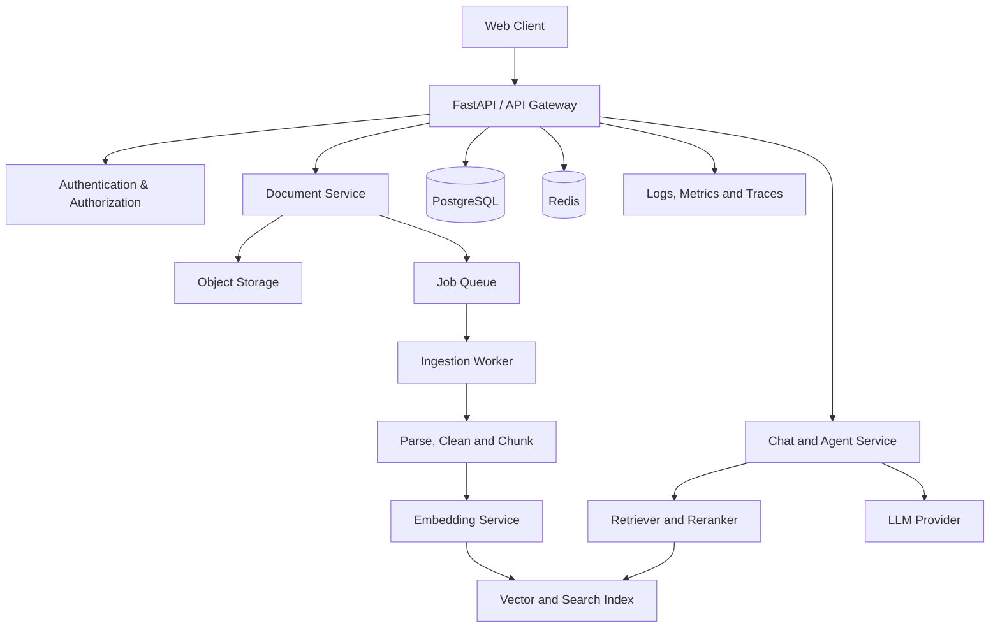
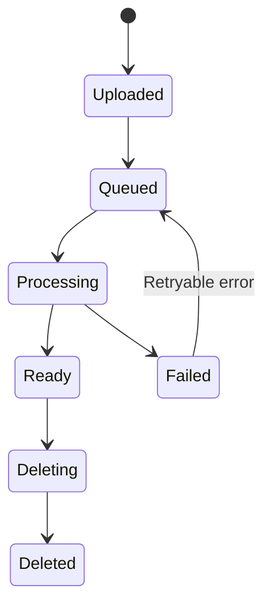

# LỘ TRÌNH SYSTEM DESIGN CHO AI ENGINEER

## Giáo trình 8 tuần xây dựng Production-Ready RAG & AI Agent System

**Đối tượng:** AI Engineer Intern đang xây dựng AI Agent, RAG, chatbot và hệ thống xử lý tài liệu  
**Thời lượng:** 8 tuần, khoảng 10–12 giờ mỗi tuần  
**Project xuyên suốt:** Enterprise Document RAG Assistant  
**Phiên bản:** 1.0  

---

## Mục lục

1. Mục tiêu và cách sử dụng tài liệu
2. System Design quan trọng thế nào với AI Engineer
3. Project xuyên suốt và phạm vi
4. Kiến trúc mục tiêu
5. Nguyên tắc học tập và thời gian biểu
6. Tuần 0 – Chuẩn bị nền tảng và môi trường
7. Tuần 1 – Requirements, estimation và tư duy trade-off
8. Tuần 2 – HTTP, API, stateless service và scalability
9. Tuần 3 – Data modeling và storage
10. Tuần 4 – Queue và document ingestion
11. Tuần 5 – Retrieval System Design
12. Tuần 6 – Cache, performance và cost
13. Tuần 7 – Reliability, security và observability
14. Tuần 8 – Deployment, documentation và portfolio
15. RAG evaluation framework
16. AI Agent System Design mở rộng
17. Ánh xạ kiến trúc sang Azure
18. Cấu trúc repository đề xuất
19. Mẫu tài liệu kỹ thuật và ADR
20. Checklist nghiệm thu
21. Bộ câu hỏi phỏng vấn và tự kiểm tra
22. Lộ trình tiếp theo sau 8 tuần
23. Nguồn học tập

---

# 1. Mục tiêu và cách sử dụng tài liệu

Tài liệu này không đặt mục tiêu giúp người học ghi nhớ thật nhiều định nghĩa System Design. Mục tiêu là giúp một AI Engineer có thể thiết kế, xây dựng, đánh giá và giải thích một hệ thống AI hoạt động từ đầu đến cuối.

Sau 8 tuần, người học cần có khả năng:

- Chuyển một yêu cầu chatbot hoặc RAG thành functional và non-functional requirements.
- Ước lượng traffic, storage, số vector, lượng token và chi phí tương đối.
- Thiết kế API, database schema, ingestion pipeline và query pipeline.
- Phân biệt vai trò của PostgreSQL, object storage, vector index, queue và cache.
- Thiết kế background processing có retry, timeout và idempotency.
- Xây retrieval pipeline có metadata filtering, hybrid search và reranking.
- Đánh giá retrieval và generation bằng dữ liệu kiểm thử thay vì cảm giác.
- Thiết kế authentication, authorization và tenant isolation.
- Theo dõi latency, token, error, trace và chi phí.
- Giải thích trade-off giữa các phương án kỹ thuật.
- Trình bày kiến trúc trong khoảng 15–20 phút.

## 1.1 Cách sử dụng

Mỗi chủ đề được học theo chu trình:

1. **Understand:** hiểu vấn đề mà khái niệm giải quyết.
2. **Design:** quyết định vị trí của khái niệm trong hệ thống.
3. **Implement:** xây một phiên bản tối thiểu.
4. **Measure:** đo latency, quality, error hoặc cost.
5. **Explain:** ghi lại trade-off và điều kiện cần thay đổi thiết kế.

Không đánh dấu một chủ đề là hoàn thành nếu chỉ đọc xong. Một chủ đề chỉ hoàn thành khi có ít nhất một trong các đầu ra: diagram, code, test, metric hoặc design decision.

---

# 2. System Design quan trọng thế nào với AI Engineer

Một AI demo có thể chỉ cần prompt, model và giao diện. Một sản phẩm AI cần thêm nhiều câu trả lời:

- Người dùng được xác thực và phân quyền thế nào?
- Dữ liệu được lưu ở đâu và tồn tại bao lâu?
- Tài liệu lớn được xử lý mà không làm nghẽn API thế nào?
- Nếu LLM hoặc vector database bị lỗi thì hệ thống phản ứng ra sao?
- Làm sao ngăn người dùng A tìm thấy tài liệu của người dùng B?
- Làm sao đo câu trả lời đúng, có căn cứ và đúng citation?
- Khi traffic tăng 10 lần thì thành phần nào cần scale trước?
- Làm sao kiểm soát token, latency và chi phí?
- Làm sao debug một câu trả lời sai qua nhiều bước agent?

System Design của AI Engineer gồm bốn lớp liên kết:

| Lớp | Nội dung chính |
|---|---|
| Software/backend | API, database, async processing, authentication |
| Distributed system | cache, queue, retry, scaling, consistency |
| AI/ML | embeddings, retrieval, reranking, LLM, evaluation |
| Operations | deployment, logs, metrics, tracing, security, cost |

Điểm khác biệt quan trọng là hệ thống AI có tính không xác định. Một API truyền thống thường có output đúng/sai rõ ràng; RAG có thể chạy thành công về mặt kỹ thuật nhưng trả lời sai vì retrieval kém, context thiếu hoặc model suy diễn quá mức. Do đó System Design cho AI phải bao gồm cả **system reliability** và **answer quality**.

---

# 3. Project xuyên suốt và phạm vi

## 3.1 Bài toán

Xây dựng **Enterprise Document RAG Assistant** cho phép người dùng:

- Đăng nhập.
- Upload PDF, DOCX hoặc TXT.
- Theo dõi trạng thái xử lý.
- Hỏi đáp dựa trên tài liệu được phép truy cập.
- Nhận câu trả lời có citation gồm tài liệu, trang và đoạn nguồn.
- Xem conversation history.
- Xóa tài liệu và dữ liệu liên quan.
- Nhận phản hồi hợp lý khi hệ thống không tìm thấy bằng chứng.

## 3.2 Ngoài phạm vi phiên bản đầu

- Voice assistant.
- Web search.
- Fine-tuning model.
- Kubernetes production cluster.
- Microservices cho mọi module.
- Multi-region active-active.
- Hàng triệu concurrent users.
- Agent tự động thực hiện hành động có ảnh hưởng lớn.

## 3.3 Functional requirements

| ID | Yêu cầu |
|---|---|
| FR-01 | Người dùng đăng nhập và nhận identity hợp lệ |
| FR-02 | Người dùng upload file trong loại và kích thước cho phép |
| FR-03 | Hệ thống trả về document ID và trạng thái xử lý |
| FR-04 | Worker parse, chunk, embed và index tài liệu |
| FR-05 | Người dùng chỉ truy vấn tài liệu được phép |
| FR-06 | Hệ thống trả lời kèm citation |
| FR-07 | Hệ thống lưu conversation và message |
| FR-08 | Người dùng có thể xóa tài liệu |
| FR-09 | Hệ thống từ chối hoặc cảnh báo file lỗi/password-protected |
| FR-10 | Hệ thống báo không đủ bằng chứng khi retrieval không phù hợp |

## 3.4 Non-functional requirements ban đầu

Các con số dưới đây là mục tiêu học tập, cần điều chỉnh bằng đo đạc:

| Thuộc tính | Mục tiêu ban đầu |
|---|---:|
| API availability | 99.5% |
| P95 retrieval latency | dưới 700 ms |
| P95 time-to-first-token | dưới 3 giây |
| Upload acknowledgement | dưới 1 giây, không tính truyền file |
| File size tối đa | 20 MB |
| Concurrent active users | 50 |
| Retrieval Recall@5 | ít nhất 80% trên evaluation set |
| Citation correctness | ít nhất 90% |
| Cross-tenant retrieval | 0 trường hợp |

---

# 4. Kiến trúc mục tiêu

## 4.1 High-level architecture



## 4.2 Hai data flow quan trọng

### Ingestion flow

1. Client upload file.
2. API xác thực người dùng và kiểm tra sơ bộ.
3. File được lưu vào object storage.
4. Metadata và trạng thái `uploaded` được ghi vào PostgreSQL.
5. Job được đưa vào queue.
6. Worker lấy job, parse nội dung và layout.
7. Nội dung được làm sạch, chia chunk và gắn metadata.
8. Worker gọi embedding model theo batch.
9. Chunk và vector được upsert vào vector index.
10. Document chuyển sang `ready`; nếu lỗi chuyển sang `failed`.

### Query flow

1. Người dùng gửi câu hỏi.
2. API xác thực identity và quyền truy cập conversation.
3. Query được chuẩn hóa; có thể phân loại intent.
4. Hệ thống tạo query embedding.
5. Retriever thực hiện vector/hybrid search kèm access-control filter.
6. Reranker sắp xếp candidate nếu cần.
7. Context builder loại trùng, giới hạn token và giữ citation metadata.
8. LLM tạo câu trả lời dựa trên context.
9. Post-processor kiểm tra cấu trúc output và citation.
10. Message, usage và trace được lưu.
11. Câu trả lời được stream về client.

## 4.3 Kiến trúc triển khai ban đầu

Nên sử dụng **modular monolith** cộng một worker, không tách microservices quá sớm:

- Một API application, chia module rõ ràng.
- Một hoặc nhiều ingestion worker.
- PostgreSQL.
- Object storage.
- Vector search.
- Redis/queue khi có nhu cầu.
- Managed LLM/embedding API.

Chỉ tách service khi có bằng chứng như: cần scale độc lập, release cycle khác nhau, ownership khác nhau hoặc workload gây ảnh hưởng lẫn nhau.

---

# 5. Nguyên tắc học tập và thời gian biểu

## 5.1 Lịch 10–12 giờ mỗi tuần

| Ngày | Thời lượng | Công việc |
|---|---:|---|
| Thứ Hai | 60–90 phút | Đọc khái niệm và ghi câu hỏi |
| Thứ Ba | 60–90 phút | Ánh xạ khái niệm vào RAG |
| Thứ Tư | 90 phút | Vẽ diagram, API hoặc data model |
| Thứ Năm | 90 phút | Implement |
| Thứ Sáu | 60–90 phút | Test và sửa lỗi |
| Thứ Bảy | 2–3 giờ | Hoàn thiện milestone |
| Chủ Nhật | 1–2 giờ | Đo đạc, viết design note, retrospective |

## 5.2 Mẫu một buổi 90 phút

- 10 phút: ôn lại buổi trước.
- 25 phút: đọc một phần nhỏ có mục tiêu.
- 40 phút: áp dụng vào project.
- 15 phút: ghi decision, metric và câu hỏi.

## 5.3 Definition of Done cho một chủ đề

- Có giải thích bằng lời của bản thân.
- Có ví dụ trong project.
- Có ít nhất một diagram/code/test/metric.
- Có trade-off và alternative.
- Biết điều kiện nào khiến quyết định hiện tại không còn phù hợp.

---

# 6. Tuần 0 – Chuẩn bị nền tảng và môi trường

## Mục tiêu

Chuẩn bị repository, công cụ và kiến thức tối thiểu để lộ trình không bị gián đoạn.

## Kiến thức cần kiểm tra

- Git: branch, commit, merge, pull request.
- Python: typing, exception, context manager, async/await cơ bản.
- HTTP: request, response, header, status code.
- SQL: SELECT, JOIN, INSERT, UPDATE, index cơ bản.
- Docker: image, container, volume, environment variable.
- Testing: unit test và integration test cơ bản.

## Công việc

1. Tạo repository và README tối thiểu.
2. Cấu hình Python project bằng `pyproject.toml`.
3. Tạo `.env.example`, không commit secret.
4. Tạo FastAPI app và `/health`.
5. Tạo PostgreSQL bằng Docker Compose.
6. Thiết lập pytest, formatter và linter.
7. Tạo thư mục `docs/decisions` cho ADR.
8. Chọn một bộ 5–10 tài liệu thử nghiệm không nhạy cảm.

## Milestone

```bash
docker compose up
curl http://localhost:8000/health
pytest
```

Tất cả phải chạy được từ hướng dẫn trong README.

---

# 7. Tuần 1 – Requirements, estimation và tư duy trade-off

## Chủ đề cần học

- Performance và scalability.
- Latency và throughput.
- Availability và consistency.
- CAP theorem ở mức ứng dụng.
- Functional/non-functional requirements.
- Back-of-the-envelope estimation.
- Bottleneck và trade-off.

## Ngày 1 – Problem statement và scope

Viết một problem statement dưới 150 từ, sau đó xác định:

- Primary users.
- Main use cases.
- Dữ liệu đầu vào/đầu ra.
- Dữ liệu nhạy cảm hay không.
- In-scope và out-of-scope.
- Success criteria.

**Bài tập:** giải thích project trong 60 giây mà không nhắc đến framework hoặc cloud service.

## Ngày 2 – Functional requirements

Viết user story và acceptance criteria. Ví dụ:

> Là người dùng, tôi muốn upload PDF để có thể hỏi đáp trên tài liệu. API phải trả document ID; tài liệu chuyển qua các trạng thái rõ ràng; khi ready, người dùng mới có thể truy vấn.

Ưu tiên yêu cầu theo Must/Should/Could/Won't.

## Ngày 3 – Non-functional requirements

Xác định:

- Latency target.
- Availability target.
- Data retention.
- File limit.
- Concurrency.
- Security boundary.
- Quality metrics.
- Cost ceiling giả định.

Phân biệt:

- P50: trải nghiệm phổ biến.
- P95/P99: trải nghiệm đuôi chậm.
- Throughput: lượng công việc trong một đơn vị thời gian.
- Concurrency: số công việc đang tồn tại đồng thời.

## Ngày 4 – Capacity estimation

Giả định:

- 1.000 registered users.
- 100 daily active users.
- 20 query/user/day.
- 2.000 query/day.
- Peak traffic gấp 10 lần trung bình.
- 10.000 documents.
- 40 chunks/document.
- 400.000 vectors.

Thực hiện:

1. Tính average QPS và peak QPS.
2. Ước lượng tổng chunk.
3. Ước lượng raw vector size: `number_of_vectors × dimensions × bytes_per_value`.
4. Cộng overhead metadata/index bằng một hệ số giả định và ghi rõ.
5. Ước lượng token ingestion và query theo ngày.
6. Xác định dependency có khả năng tốn chi phí nhất.

Mục tiêu không phải con số tuyệt đối chính xác mà là phương pháp và giả định minh bạch.

## Ngày 5 – Context diagram

Vẽ:

- User/client.
- Hệ thống của mình.
- Identity provider.
- LLM/embedding provider.
- Storage/search dependencies.

Không đi sâu class hoặc function ở diagram này.

## Ngày 6 – Risk register

Tạo bảng:

| Risk | Impact | Probability | Detection | Mitigation |
|---|---|---|---|---|
| Cross-tenant data leak | Critical | Medium | Security tests | Mandatory tenant filter |
| Hallucinated answer | High | High | Evaluation | Grounding and refusal |
| LLM rate limit | Medium | Medium | 429 metrics | Queue/backoff/quota |
| Duplicate indexing | Medium | Medium | Duplicate count | Idempotent upsert |

## Ngày 7 – Review

Đầu ra:

- `docs/requirements.md`
- `docs/capacity-estimation.md`
- Context diagram.
- Risk register.
- ADR đầu tiên: modular monolith thay vì microservices.

---

# 8. Tuần 2 – HTTP, API, stateless service và scalability

## Chủ đề cần học

- DNS, HTTP, TLS.
- Reverse proxy và load balancer.
- Vertical/horizontal scaling.
- REST API design.
- Sync, async, concurrency.
- Stateless application.
- Streaming response.
- API versioning và idempotency key.

## Ngày 1 – Thiết kế API contract

Endpoint gợi ý:

```text
POST   /v1/documents
GET    /v1/documents
GET    /v1/documents/{document_id}
DELETE /v1/documents/{document_id}
POST   /v1/conversations
GET    /v1/conversations/{conversation_id}
POST   /v1/conversations/{conversation_id}/messages
GET    /v1/conversations/{conversation_id}/messages
GET    /health
GET    /ready
```

Với mỗi endpoint, mô tả:

- Authentication requirement.
- Request schema.
- Response schema.
- Error codes.
- Idempotency behavior.
- Pagination.
- Rate limit.

## Ngày 2 – Error model

Chuẩn hóa error:

```json
{
  "error": {
    "code": "DOCUMENT_NOT_READY",
    "message": "The document is still being processed.",
    "request_id": "req_...",
    "details": {}
  }
}
```

Phân biệt 400, 401, 403, 404, 409, 413, 422, 429 và 5xx.

## Ngày 3 – Stateless service

Không lưu conversation, document state hoặc permission trong RAM của một API instance. Lý do:

- Request sau có thể đến instance khác.
- Restart làm mất state.
- Scale ngang trở nên khó khăn.
- Test và recovery phức tạp.

State lâu dài lưu ở database/object storage; cache chỉ là bản sao có thể mất.

## Ngày 4 – Async và streaming

Phân loại:

- Upload acknowledgement: request ngắn.
- Ingestion: background job.
- Chat generation: request dài và có thể stream.
- Batch evaluation: background job.

Học tác động của timeout giữa client, reverse proxy, API và LLM provider.

## Ngày 5 – Implement API

- Pydantic schemas.
- Dependency injection.
- Central exception handler.
- Request ID middleware.
- Structured log.
- Pagination.

## Ngày 6 – Load test

Dùng Locust/k6, kiểm tra ít nhất:

- 10, 25 và 50 concurrent clients.
- P50/P95 latency.
- Error rate.
- Requests per second.
- CPU/memory.

Không load-test LLM thật quá mức; có thể dùng mock provider để tách backend performance khỏi external API.

## Ngày 7 – Review

Đầu ra:

- OpenAPI contract.
- API implementation.
- Error catalog.
- Load-test report.
- ADR: sync acknowledgement + async ingestion.

---

# 9. Tuần 3 – Data modeling và storage

## Chủ đề cần học

- RDBMS, schema và transaction.
- Index và query plan cơ bản.
- SQL vs NoSQL.
- Object storage.
- Vector index.
- Replication và partitioning ở mức tổng quan.
- Data lifecycle và deletion.

## Phân loại dữ liệu

| Dữ liệu | Storage | Lý do |
|---|---|---|
| User, tenant, role | PostgreSQL | Quan hệ, constraint, transaction |
| Document metadata | PostgreSQL | Trạng thái và ownership |
| File gốc | Object storage | Phù hợp binary object |
| Chunk + embedding | Vector/search index | Similarity và hybrid search |
| Conversation/message | PostgreSQL trước | Dễ audit và truy vấn |
| Cache/session ngắn | Redis | TTL và tốc độ |
| Logs/traces | Observability backend | Truy vấn vận hành |

## Data model đề xuất

### documents

- `id`
- `tenant_id`
- `owner_id`
- `file_name`
- `content_type`
- `size_bytes`
- `checksum`
- `storage_uri`
- `status`
- `version`
- `error_code`
- `created_at`, `updated_at`

### document_jobs

- `id`
- `document_id`
- `job_type`
- `status`
- `attempt_count`
- `last_error`
- `started_at`, `completed_at`

### conversations

- `id`
- `tenant_id`
- `user_id`
- `title`
- `created_at`, `updated_at`

### messages

- `id`
- `conversation_id`
- `role`
- `content`
- `model`
- `prompt_tokens`
- `completion_tokens`
- `latency_ms`
- `created_at`

### citations

- `id`
- `message_id`
- `document_id`
- `chunk_id`
- `page_number`
- `quoted_span` hoặc `source_excerpt`
- `rank`
- `score`

## Thực hành theo ngày

1. Vẽ ERD.
2. Xác định primary key, foreign key, unique constraint.
3. Tạo migration với Alembic.
4. Implement repository layer.
5. Tích hợp MinIO hoặc Azure Blob.
6. Thêm index cho truy vấn phổ biến.
7. Test transaction, ownership và deletion.

## Những câu hỏi phải trả lời

- Khi xóa document, file, chunk, vector và citation xử lý thế nào?
- Xóa đồng bộ hay đánh dấu rồi background cleanup?
- Nếu object upload thành công nhưng database insert thất bại thì sao?
- Checksum dùng để phát hiện file trùng như thế nào?
- Document version ảnh hưởng cache và vector thế nào?
- Backup metadata có đủ không, hay cần backup file/index?

## Milestone

- Upload file thật vào object storage.
- Metadata nằm trong PostgreSQL.
- API không trả internal storage URI cho user nếu không cần.
- User khác không đọc hoặc xóa được document.

---

# 10. Tuần 4 – Queue và document ingestion

## Chủ đề cần học

- Producer, queue, consumer.
- Task queue và message broker.
- At-most-once, at-least-once.
- Idempotency.
- Exponential backoff và jitter.
- Dead-letter queue.
- Back pressure.
- Batch processing.

## Document state machine



Chỉ cho phép transition hợp lệ. Ví dụ `deleted → processing` phải bị từ chối.

## Worker pipeline chi tiết

1. Nhận job kèm document ID, không nhét toàn bộ file vào message.
2. Kiểm tra document tồn tại và job chưa hoàn thành.
3. Download file qua private storage access.
4. Kiểm tra file signature, type, size và protection.
5. Parse text, page, table hoặc layout.
6. Normalize nhưng giữ page/section mapping.
7. Chia chunk và tạo deterministic chunk ID.
8. Batch embedding với giới hạn kích thước.
9. Upsert vector, không blind insert.
10. Kiểm tra số chunk đã index.
11. Cập nhật document `ready` trong operation an toàn.
12. Emit metrics và cleanup temporary file.

## Idempotency design

Một worker có thể nhận lại cùng message. Do đó:

- Dùng deterministic chunk ID: hash của `document_id + version + chunk_index`.
- Upsert vector theo ID.
- Lưu job attempt.
- Kiểm tra trạng thái trước khi xử lý.
- Không tăng counter hoặc tạo resource không idempotent mà thiếu guard.
- Có thể dùng idempotency key cho upload request.

## Retry policy mẫu

| Lỗi | Retry? | Hành động |
|---|---|---|
| File password-protected | Không | Failed với lỗi rõ ràng |
| Corrupted file | Không | Failed |
| Unsupported type | Không | Reject/failed |
| Embedding 429 | Có | Backoff + jitter |
| Embedding 5xx | Có giới hạn | Retry |
| Vector DB timeout | Có giới hạn | Retry/upsert |
| Validation bug | Không tự động vô hạn | DLQ và điều tra |

## Back pressure

Khi upload nhanh hơn worker xử lý:

- Đo queue depth và oldest-message age.
- Giới hạn upload/user.
- Tăng worker trong giới hạn quota.
- Batch embedding.
- Có maximum queue age.
- Không để worker tạo request vô hạn đến provider đang rate-limit.

## Test bắt buộc

- Duplicate delivery.
- Worker crash sau embedding nhưng trước cập nhật status.
- Embedding timeout.
- Vector upsert timeout.
- File corrupted.
- File password-protected.
- File không có text.
- Document bị xóa trong lúc processing.

---

# 11. Tuần 5 – Retrieval System Design

## Mục tiêu

Xây retrieval pipeline có thể đo, debug và cải tiến.

## Thành phần

1. Query preprocessing.
2. Optional intent classification/query rewriting.
3. Dense retrieval.
4. Keyword/BM25 retrieval.
5. Metadata và ACL filtering.
6. Fusion.
7. Reranking.
8. Context selection.
9. Answer generation.
10. Citation mapping.

## Chunking experiments

So sánh ít nhất ba cấu hình:

| Cấu hình | Kích thước | Overlap | Khi phù hợp |
|---|---:|---:|---|
| Fixed-size | 300–500 tokens | 10–20% | Baseline dễ làm |
| Recursive | Theo separator | 10–20% | Văn bản thông thường |
| Section-aware | Heading/paragraph | Tùy section | Tài liệu có cấu trúc |

Đừng chỉ tối ưu chunk size. Cần bảo toàn:

- Page number.
- Section title.
- Table boundary.
- Source document.
- Access-control metadata.
- Document version.

## Dense, keyword và hybrid retrieval

- Dense retrieval tốt khi query và document khác từ nhưng giống nghĩa.
- Keyword/BM25 tốt với mã, tên riêng, thuật ngữ chính xác.
- Hybrid search kết hợp cả hai, thường phù hợp enterprise documents.
- Reranker tăng precision nhưng làm tăng latency và cost.

## Metadata filter là security boundary

Không retrieve toàn index rồi lọc ở application nếu engine hỗ trợ pre-filter. Query phải kèm tenant/user/document authorization. Test security không chỉ test API mà còn test retrieval layer.

## Context builder

Context builder cần:

- Loại duplicate/near-duplicate.
- Giới hạn tổng token.
- Giữ source metadata.
- Có thể đa dạng hóa document/section.
- Không cắt mất đoạn chứa bằng chứng.
- Sắp xếp context hợp lý.
- Không cho instruction trong tài liệu thay đổi system policy.

## Evaluation dataset

Tạo ít nhất 30–50 câu hỏi có:

- `question_id`
- `question`
- `expected_document_ids`
- `expected_page_numbers`
- `expected_answer` hoặc answer rubric
- `question_type`
- `answerable`
- `notes`

Các nhóm:

- Single-hop factual.
- Multi-chunk.
- Exact keyword/entity.
- Paraphrased semantic query.
- Unanswerable.
- Ambiguous.
- Cross-tenant negative test.
- Table/layout question nếu hệ thống hỗ trợ.

## Metrics retrieval

- **Recall@K:** tài liệu/chunk đúng có trong top K hay không.
- **Precision@K:** bao nhiêu kết quả top K thực sự liên quan.
- **MRR:** vị trí của kết quả đúng đầu tiên.
- **nDCG:** đánh giá thứ hạng có nhiều mức relevance.
- Retrieval latency P50/P95.
- Empty-result rate.
- Filter correctness.

## Experiment table

| Experiment | Chunk strategy | Retrieval | Reranker | Recall@5 | MRR | P95 latency |
|---|---|---|---|---:|---:|---:|
| E01 | Fixed 400/80 | Dense | No | | | |
| E02 | Recursive | Hybrid | No | | | |
| E03 | Section-aware | Hybrid | Yes | | | |

Chỉ thay một hoặc ít biến mỗi experiment để kết luận có ý nghĩa.

---

# 12. Tuần 6 – Cache, performance và cost

## Chủ đề

- Cache-aside.
- TTL và invalidation.
- LRU và eviction.
- Cache stampede.
- Rate limiting.
- Connection pooling.
- Batching.
- Performance profiling.
- Token/cost accounting.

## Đo baseline trước

Trace latency theo stage:

```text
authentication_ms
query_embedding_ms
retrieval_ms
reranking_ms
context_building_ms
llm_first_token_ms
llm_total_ms
database_write_ms
request_total_ms
```

Nếu chưa đo, không biết cache phần nào.

## Cache candidates

| Dữ liệu | Khuyến nghị | Rủi ro |
|---|---|---|
| Query embedding | Tốt để bắt đầu | Model version thay đổi |
| Parsed document | Hữu ích cho retry | Storage tăng |
| Retrieval result | Có điều kiện | Stale khi index thay đổi |
| Rerank result | Có điều kiện | Key phức tạp |
| Final answer | Rất thận trọng | Privacy, freshness, context |
| Permission | TTL ngắn | Quyền bị thu hồi nhưng cache chưa hết |

## Cache key principles

Key phải bao gồm những yếu tố thay đổi kết quả:

- Tenant/user scope.
- Model version.
- Index/document version.
- Normalized query hash.
- Retrieval parameters.
- Permission scope nếu liên quan.

Không đưa raw sensitive query vào key nếu cache/log có thể lộ.

## Cache failure behavior

Redis nên là optimization, không phải single point of failure cho core flow nếu không cần. Khi Redis lỗi:

- Có timeout ngắn.
- Bỏ qua cache và gọi dependency thật.
- Emit metric.
- Tránh retry Redis quá nhiều làm chậm request.

## Rate limiting

Thiết kế theo:

- Request/user/minute.
- Token/user/day.
- Concurrent generation/user.
- Upload size và count.
- Tenant quota.

Trả 429 kèm thông tin retry hợp lý; không để một user chiếm toàn bộ quota.

## Cost dashboard tối thiểu

- Prompt/completion tokens theo user/tenant/model.
- Embedding tokens theo ingestion/query.
- Cache hit rate.
- Average cost/query ước tính.
- Cost theo feature.
- Failed calls vẫn phát sinh chi phí hay không.
- Top conversations/documents tiêu thụ lớn.

## Milestone

Tạo báo cáo before/after gồm P50, P95, error rate, cache hit rate, external call count và estimated cost.

---

# 13. Tuần 7 – Reliability, security và observability

## 13.1 Reliability

### Timeout budget

Một request không nên để mỗi dependency dùng timeout tùy ý. Ví dụ tổng budget 20 giây:

- Authentication: 0.5 giây.
- Retrieval: 1 giây.
- Reranking: 1.5 giây.
- LLM first token: 5 giây.
- Generation: phần còn lại.

Con số phải dựa trên provider và UX thật.

### Retry

- Retry lỗi tạm thời: timeout, 429, một số 5xx.
- Không retry lỗi validation, permission, unsupported file.
- Exponential backoff + jitter.
- Có max attempts và max elapsed time.
- Retry write phải idempotent.
- Không retry ở nhiều layer gây retry amplification.

### Circuit breaker và fallback

Circuit breaker hữu ích khi dependency lỗi kéo dài. Fallback có thể là:

- Bỏ reranker và dùng retrieval order.
- Bỏ cache khi Redis lỗi.
- Trả lời hệ thống tạm thời không thể truy vấn thay vì hallucinate.
- Keyword retrieval khi vector service unavailable, nếu đã được kiểm thử.

Fallback phải được đánh dấu trong response/telemetry và không được làm giảm security.

## 13.2 Security

### Authentication và authorization

- Authentication trả lời “ai đang gọi”.
- Authorization trả lời “người đó được phép làm gì”.
- Mọi document/conversation query phải có tenant/user scope.
- Không tin `user_id` gửi từ client; lấy identity từ token đã xác minh.
- Kiểm tra ownership ở service/repository boundary.

### File security

- Allowlist file types.
- Kiểm tra MIME và file signature, không chỉ extension.
- Giới hạn size, page count và decompressed size.
- File password-protected được phát hiện sớm.
- Temporary files được cleanup.
- Không execute nội dung upload.
- Malware scanning tùy môi trường production.

### Prompt injection

Xem document content là dữ liệu không đáng tin, không phải system instruction.

- Tách system instruction và retrieved content rõ ràng.
- Agent tool có permission độc lập với nội dung retrieval.
- Không để tài liệu tự cấp quyền gọi tool.
- Tool arguments cần schema validation.
- Tool có side effect cần approval/authorization phù hợp.
- Đánh giá prompt-injection test cases.

### Secrets và privacy

- Secret nằm trong secret manager/environment, không commit Git.
- Không log API key, access token, password.
- Hạn chế log full prompt/document.
- Có retention policy cho message và trace.
- Mã hóa in transit; managed storage encryption at rest.
- Xác định quy trình xóa dữ liệu.

## 13.3 Observability

### Logs

Structured log có:

- Timestamp.
- Level.
- Request/trace ID.
- Route/service.
- Tenant/user pseudonymous identifier nếu phù hợp.
- Document/conversation ID.
- Event name.
- Error class/code.
- Duration.

### Metrics

**Backend:** request rate, error rate, latency, CPU, memory, DB pool.  
**Queue:** depth, oldest age, processing time, retry, DLQ.  
**AI:** token, provider latency, 429/5xx, cache hit, retrieval count.  
**Quality:** Recall@K, citation correctness, unanswerable accuracy, user feedback.  
**Security:** forbidden attempts, cross-tenant tests, suspicious upload failures.

### Tracing

Một trace chat nên có spans:

```text
chat_request
├── authenticate
├── load_conversation
├── embed_query
├── retrieve
├── rerank
├── build_context
├── generate_answer
├── validate_citations
└── persist_message
```

Không đặt sensitive raw content làm span attribute.

## Failure-mode table

| Component | Failure | User impact | Detection | Recovery |
|---|---|---|---|---|
| LLM | Timeout | Chưa có answer | Timeout metric | Retry/fail clearly |
| Vector index | Down | Không retrieve | Health/5xx | Fallback or unavailable |
| DB | Pool exhausted | API errors | Pool metrics | Limit/pool/scale |
| Queue | Backlog | Document chậm ready | Queue age | Scale workers/throttle |
| Worker | Crash | Job incomplete | Heartbeat/job timeout | Redelivery/idempotency |

---

# 14. Tuần 8 – Deployment, documentation và portfolio

## Deployment progression

1. Local process.
2. Docker Compose.
3. Single cloud environment.
4. Staging và production separation khi cần.
5. Scale component dựa trên metric.

## CI pipeline tối thiểu

- Install locked dependencies.
- Lint/format check.
- Type check.
- Unit tests.
- Integration tests phù hợp.
- Security/dependency scan cơ bản.
- Build container.
- Không deploy nếu test fail.

## Container practices

- Image nhỏ và pinned version.
- Chạy non-root nếu phù hợp.
- Health/readiness endpoint.
- Không bake secret vào image.
- Graceful shutdown, đặc biệt worker.
- Resource limits.
- Immutable deployment artifact.

## README portfolio

README cần trả lời nhanh:

1. Bài toán gì?
2. Ai sử dụng?
3. Tính năng chính?
4. Kiến trúc?
5. Tại sao chọn tech stack?
6. Chạy local thế nào?
7. Evaluation kết quả ra sao?
8. Reliability/security đã xử lý gì?
9. Limitations?
10. Roadmap?

## System Design document

Cấu trúc đề xuất:

```text
1. Executive summary
2. Requirements and scope
3. Capacity assumptions
4. High-level architecture
5. API design
6. Data model
7. Document ingestion deep dive
8. Retrieval and generation deep dive
9. Security and tenancy
10. Reliability and failure handling
11. Observability
12. Evaluation
13. Cost and scaling
14. Alternatives and ADRs
15. Limitations and future work
```

## Demo script 10 phút

- 1 phút: bài toán và người dùng.
- 1 phút: architecture.
- 2 phút: upload và background processing.
- 2 phút: hỏi đáp và citation.
- 1 phút: access-control test.
- 1 phút: trace/metrics.
- 1 phút: evaluation result.
- 1 phút: trade-off và roadmap.

---

# 15. RAG evaluation framework

## Ba lớp đánh giá

### Lớp 1 – Ingestion quality

- Parse success rate.
- Text coverage.
- Page mapping correctness.
- Table/layout preservation.
- Duplicate chunk rate.
- Empty/very short chunk rate.

### Lớp 2 – Retrieval quality

- Recall@K.
- Precision@K.
- MRR/nDCG.
- ACL filter correctness.
- Retrieval latency.

### Lớp 3 – Answer quality

- Correctness.
- Faithfulness/groundedness.
- Relevance.
- Citation correctness.
- Citation completeness.
- Unanswerable handling.
- Safety/prompt injection resistance.

## Evaluation workflow

1. Version dataset.
2. Version pipeline configuration.
3. Chạy baseline.
4. Lưu per-question result, không chỉ aggregate score.
5. Phân loại lỗi.
6. Thay đổi một giả thuyết.
7. Chạy lại và so sánh.
8. Kiểm tra regression trước deploy.

## Error taxonomy

- Parser missed content.
- Bad chunk boundary.
- Correct chunk not retrieved.
- Correct chunk retrieved but reranked low.
- Context truncated.
- LLM ignored context.
- Hallucinated unsupported claim.
- Wrong citation mapping.
- Correct refusal on unanswerable.
- Incorrect refusal despite evidence.

## Không chỉ dùng LLM-as-a-judge

LLM judge hữu ích để mở rộng đánh giá nhưng cần:

- Rubric rõ.
- Human-reviewed subset.
- Judge model/version được ghi lại.
- Kiểm tra bias và consistency.
- Deterministic metrics cho retrieval/citation khi có thể.

---

# 16. AI Agent System Design mở rộng

RAG chatbot thường là một pipeline khá xác định. Agent bổ sung planning, tool selection và loop, làm tăng rủi ro latency, cost và side effect.

## Thành phần agent

- Intent/router.
- Planner hoặc policy.
- Tool registry.
- Tool executor.
- Short-term conversation state.
- Long-term memory nếu thực sự cần.
- Guardrails.
- Human approval.
- Trace và evaluation.

## Tool contract

Mỗi tool cần:

- Tên và mô tả rõ.
- Input JSON schema.
- Output schema.
- Authentication context.
- Permission requirement.
- Timeout.
- Retry behavior.
- Idempotency behavior.
- Side-effect classification.
- Audit log.

## Agent loop limits

- Maximum steps.
- Maximum tokens/cost.
- Per-tool timeout.
- Repeated-call detection.
- Overall deadline.
- Stop condition.
- Fallback khi planner lỗi.

## Phân loại tool

| Loại | Ví dụ | Chính sách |
|---|---|---|
| Read-only | Search document | Có thể tự động trong quyền |
| Reversible write | Tạo draft | Xác nhận tùy bối cảnh |
| External communication | Gửi email/message | Xác minh recipient và approval |
| Destructive | Xóa dữ liệu | Authorization và confirmation mạnh |

## Agent evaluation

- Task success rate.
- Tool selection accuracy.
- Argument correctness.
- Number of steps.
- Cost/task.
- Latency/task.
- Unauthorized-tool rate.
- Loop/failure rate.
- Recovery quality.

Hãy xây RAG pipeline đáng tin trước khi thêm agent orchestration phức tạp.

---

# 17. Ánh xạ kiến trúc sang Azure

| Nhu cầu | Azure service có thể dùng |
|---|---|
| API/container | Azure Container Apps hoặc App Service |
| PostgreSQL | Azure Database for PostgreSQL |
| Object storage | Azure Blob Storage |
| Queue | Azure Service Bus |
| Document parsing/layout | Azure AI Document Intelligence |
| Embedding/LLM | Azure OpenAI |
| Vector/hybrid retrieval | Azure AI Search |
| Secret | Azure Key Vault |
| Identity giữa service | Managed Identity |
| Logs/traces/metrics | Application Insights + Azure Monitor |

## Nguyên tắc Azure

- Local-first với interface rõ, sau đó thay adapter bằng managed service.
- Dùng Managed Identity khi có thể thay vì chia sẻ key.
- Key Vault cho secret.
- Private networking và RBAC tùy yêu cầu doanh nghiệp.
- Chọn SKU nhỏ cho demo và đặt budget alert.
- Tách resource theo environment.
- Không ghi endpoint/key trực tiếp trong code.
- Cleanup resource không dùng.

## Azure ingestion flow

```text
Client
→ Container Apps API
→ Blob Storage
→ Service Bus
→ Container Apps Job/Worker
→ Document Intelligence
→ Azure OpenAI Embeddings
→ Azure AI Search
→ PostgreSQL status update
```

## Azure query flow

```text
Client
→ Container Apps API
→ Authenticate/authorize
→ Azure AI Search hybrid retrieval with filters
→ Optional reranker
→ Azure OpenAI generation
→ PostgreSQL conversation persistence
→ Application Insights trace
```

---

# 18. Cấu trúc repository đề xuất

```text
enterprise-rag-assistant/
├── README.md
├── pyproject.toml
├── uv.lock
├── docker-compose.yml
├── Dockerfile
├── .env.example
├── Makefile
├── app/
│   ├── main.py
│   ├── api/
│   │   ├── dependencies.py
│   │   ├── errors.py
│   │   └── routes/
│   │       ├── documents.py
│   │       ├── conversations.py
│   │       └── health.py
│   ├── core/
│   │   ├── config.py
│   │   ├── logging.py
│   │   └── security.py
│   ├── domain/
│   │   ├── documents.py
│   │   ├── conversations.py
│   │   └── errors.py
│   ├── services/
│   │   ├── document_service.py
│   │   ├── chat_service.py
│   │   └── authorization_service.py
│   ├── ingestion/
│   │   ├── parser.py
│   │   ├── chunker.py
│   │   ├── embedder.py
│   │   └── pipeline.py
│   ├── retrieval/
│   │   ├── retriever.py
│   │   ├── reranker.py
│   │   └── context_builder.py
│   ├── agent/
│   │   ├── orchestrator.py
│   │   ├── tools.py
│   │   └── policies.py
│   ├── repositories/
│   │   ├── documents.py
│   │   ├── conversations.py
│   │   └── jobs.py
│   ├── infrastructure/
│   │   ├── database.py
│   │   ├── object_storage.py
│   │   ├── vector_store.py
│   │   ├── queue.py
│   │   └── llm.py
│   └── observability/
│       ├── metrics.py
│       └── tracing.py
├── workers/
│   └── ingestion_worker.py
├── migrations/
├── tests/
│   ├── unit/
│   ├── integration/
│   ├── security/
│   └── fixtures/
├── evaluation/
│   ├── datasets/
│   ├── runners/
│   └── reports/
└── docs/
    ├── architecture.md
    ├── requirements.md
    ├── capacity-estimation.md
    ├── threat-model.md
    ├── runbook.md
    └── decisions/
```

Không cần tạo mọi file ngay ngày đầu. Tạo theo milestone để tránh kiến trúc rỗng.

---

# 19. Mẫu tài liệu kỹ thuật và ADR

## ADR template

```markdown
# ADR-XXX: Tên quyết định

## Status
Proposed / Accepted / Superseded

## Context
Vấn đề và constraint nào dẫn đến quyết định?

## Decision
Chọn phương án nào?

## Alternatives considered
- Phương án A
- Phương án B

## Consequences
Lợi ích, chi phí và rủi ro.

## Revisit when
Điều kiện nào khiến cần đánh giá lại?
```

## ADR nên có

- ADR-001: Modular monolith.
- ADR-002: PostgreSQL cho metadata và conversation.
- ADR-003: Object storage cho file.
- ADR-004: Async ingestion qua queue.
- ADR-005: Hybrid retrieval.
- ADR-006: Metadata pre-filter cho tenant isolation.
- ADR-007: Cache query embedding.
- ADR-008: Evaluation gate trước release.

## Runbook template

```text
Alert:
User impact:
Dashboard/queries:
Immediate mitigation:
Root-cause checks:
Recovery verification:
Escalation:
Post-incident action:
```

Runbook cần cho queue backlog, LLM rate limit, vector index unavailable và database pool exhaustion.

---

# 20. Checklist nghiệm thu

## Requirements

- [ ] Problem statement rõ.
- [ ] Functional requirements có priority.
- [ ] Non-functional requirements đo được.
- [ ] Assumptions được ghi rõ.
- [ ] Out-of-scope rõ.

## API

- [ ] Versioned endpoints.
- [ ] Schema validation.
- [ ] Error model thống nhất.
- [ ] Pagination.
- [ ] Request ID.
- [ ] AuthN/AuthZ.
- [ ] Rate limit.

## Storage

- [ ] ERD và migration.
- [ ] Constraint/index hợp lý.
- [ ] Binary file ở object storage.
- [ ] Vector metadata có document/page/tenant/version.
- [ ] Deletion lifecycle.

## Ingestion

- [ ] Async job.
- [ ] State machine.
- [ ] Idempotent upsert.
- [ ] Retry policy.
- [ ] Corrupted/protected file handling.
- [ ] Queue metrics.
- [ ] Cleanup temporary data.

## Retrieval

- [ ] Baseline dense retrieval.
- [ ] Keyword/hybrid experiment.
- [ ] Metadata ACL filter.
- [ ] Reranking experiment.
- [ ] Citation mapping.
- [ ] Unanswerable behavior.

## Evaluation

- [ ] Versioned evaluation set.
- [ ] Recall@K/MRR.
- [ ] Answer/citation rubric.
- [ ] Security negative tests.
- [ ] Per-question error analysis.
- [ ] Regression report.

## Reliability

- [ ] Dependency timeouts.
- [ ] Retry có max attempts.
- [ ] Không retry non-retryable errors.
- [ ] Graceful failure.
- [ ] Health/readiness.
- [ ] Failure-mode table.

## Security

- [ ] Không commit secrets.
- [ ] Tenant isolation.
- [ ] File validation.
- [ ] Log redaction.
- [ ] Tool permission.
- [ ] Prompt injection tests.
- [ ] Data retention/deletion.

## Observability

- [ ] Structured logs.
- [ ] Metrics.
- [ ] Distributed trace.
- [ ] Token/cost tracking.
- [ ] Queue dashboards.
- [ ] Alerts/runbook.

## Portfolio

- [ ] README đầy đủ.
- [ ] Architecture diagram rõ.
- [ ] Demo script.
- [ ] Benchmark/evaluation table.
- [ ] ADRs.
- [ ] Limitations trung thực.

---

# 21. Bộ câu hỏi phỏng vấn và tự kiểm tra

## Cơ bản

1. Latency khác throughput thế nào?
2. Scale dọc và scale ngang khác nhau thế nào?
3. Vì sao stateless API dễ scale ngang?
4. Reverse proxy và load balancer làm gì?
5. Khi nào dùng SQL, NoSQL, object storage?
6. Cache-aside hoạt động thế nào?
7. Queue giải quyết vấn đề gì?
8. At-least-once delivery tạo rủi ro gì?
9. Idempotency là gì?
10. Availability và consistency trade-off ra sao?

## RAG

11. Vì sao chunk quá nhỏ hoặc quá lớn đều có vấn đề?
12. Dense và keyword retrieval khác nhau thế nào?
13. Khi nào hybrid search hữu ích?
14. Reranker cải thiện gì và đánh đổi gì?
15. Metadata filter liên quan security thế nào?
16. Đánh giá retrieval bằng metric nào?
17. Làm sao xử lý unanswerable question?
18. Citation correctness được đo thế nào?
19. Khi answer sai, phân biệt retrieval failure và generation failure ra sao?
20. Document update ảnh hưởng index và cache thế nào?

## Reliability

21. Retry lỗi nào và không retry lỗi nào?
22. Retry amplification là gì?
23. Worker crash giữa pipeline xử lý thế nào?
24. Nếu vector database unavailable thì sao?
25. Nếu Redis mất thì core flow có chạy không?
26. Queue backlog tăng liên tục thì điều tra gì?
27. Thiết kế timeout budget thế nào?
28. Readiness khác liveness thế nào?

## Security

29. Làm sao ngăn cross-tenant retrieval?
30. Vì sao không tin user ID từ request body?
31. File upload cần kiểm tra gì?
32. Prompt injection qua document nguy hiểm thế nào?
33. Agent tool permission nên đặt ở đâu?
34. Những dữ liệu gì không nên log?

## Scaling và cost

35. Nếu traffic tăng 10 lần, đo gì trước?
36. Khi nào tách ingestion khỏi API?
37. Khi nào cần scale worker?
38. Thành phần nào thường ảnh hưởng latency nhất?
39. Cache embedding có key và invalidation thế nào?
40. Làm sao theo dõi cost theo tenant?

## Design exercise

Hãy thiết kế hệ thống cho 1.000, 100.000 và 1.000.000 người dùng. Với mỗi mức, trình bày:

- Traffic assumptions.
- Storage/vector growth.
- Thành phần cần scale.
- Partition strategy nếu cần.
- Reliability target.
- Cost control.
- Điều gì vẫn giữ nguyên để tránh overengineering.

---

# 22. Lộ trình tiếp theo sau 8 tuần

## Giai đoạn 2 – 4 đến 6 tuần

- Multi-tenant RBAC nâng cao.
- RAG evaluation automation trong CI.
- Agent tools và approval workflow.
- Query routing cho nhiều index/domain.
- Document versioning và incremental indexing.
- Feedback loop có human review.
- Production monitoring và alerting.

## Giai đoạn 3

Chỉ học khi project hoặc công việc cần:

- Kubernetes.
- Kafka/event streaming.
- Database partitioning/sharding.
- Multi-region architecture.
- Service mesh.
- Event sourcing/CQRS.
- Model serving và GPU inference optimization.

## Hướng chuyên sâu cho AI Engineer

- LLM inference: batching, KV cache, quantization, throughput/latency.
- Vector search: ANN index, HNSW/IVF, recall-latency trade-off.
- Model routing và fallback.
- Online/offline evaluation.
- Guardrails và red teaming.
- Feature/data pipeline nếu xây ML truyền thống.
- MLOps: model registry, experiment tracking, drift monitoring.

---

# 23. Nguồn học tập

## Nguồn chính

- System Design Primer: https://github.com/donnemartin/system-design-primer
- Designing Data-Intensive Applications – Martin Kleppmann.
- Google SRE Books: https://sre.google/books/
- Microsoft Azure Architecture Center: https://learn.microsoft.com/azure/architecture/
- Azure Well-Architected Framework: https://learn.microsoft.com/azure/well-architected/
- OpenTelemetry Documentation: https://opentelemetry.io/docs/

## Cách đọc System Design Primer

Thứ tự ưu tiên:

1. Performance vs scalability.
2. Latency vs throughput.
3. Availability vs consistency.
4. CAP theorem và consistency patterns.
5. DNS, CDN, reverse proxy và load balancer.
6. Application layer và horizontal scaling.
7. Database, replication và partitioning.
8. Cache.
9. Asynchronism và queue.
10. System design interview approach.
11. Một bài mẫu đơn giản như Pastebin.
12. Một bài phức tạp hơn để học bottleneck analysis.

Mỗi phần cần ánh xạ vào RAG project. Không cần học thuộc mọi thuật ngữ hoặc lời giải.

---

# Kết luận

Sau lộ trình này, tiêu chí thành công không phải là “đã đọc xong System Design Primer” hay “đã dùng nhiều dịch vụ”. Tiêu chí là bạn có thể nhìn vào một hệ thống RAG/AI Agent và trả lời một cách có căn cứ:

- Requirement nào đang được giải quyết?
- Dữ liệu đi qua những bước nào?
- Thành phần nào lưu state?
- Hệ thống sẽ lỗi ở đâu?
- Làm sao phát hiện và phục hồi?
- Chất lượng câu trả lời được đo bằng gì?
- Security boundary nằm ở đâu?
- Chi phí và latency đến từ đâu?
- Khi nào cần scale hoặc thay đổi kiến trúc?
- Vì sao thiết kế hiện tại đơn giản nhưng đủ dùng?

Một AI Engineer giỏi không chỉ làm model trả lời được. Họ xây được một hệ thống có thể đo, kiểm thử, vận hành, bảo vệ và cải tiến theo thời gian.

